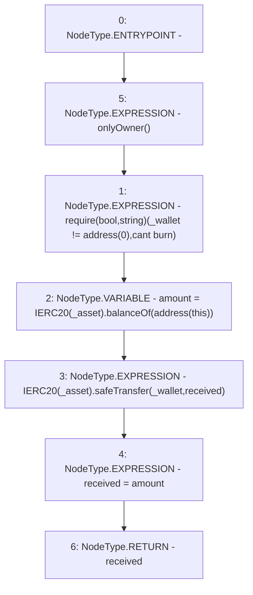

# Context: NoYield.emergencyWithdraw

**Contract:** `NoYield` (Inherits: ReentrancyGuard, OwnableUpgradeable, ContextUpgradeable, Initializable, IYield)
**Signature:** `emergencyWithdraw(address,address) returns (uint256)`
**Method Selector ID:** `0x6382d9ad`
**Visibility:** `external`
**Environment-Free:** `No (reads EVM state context)`
**Modifiers:**
- `onlyOwner`
  ```solidity
  modifier onlyOwner() {
          require(owner() == _msgSender(), "Ownable: caller is not the owner");
          _;
      }
  ```

### State Variables Interaction
- **Reads:** None
- **Writes:** None

### Assertion Checks & Business Requirements
- require/assert: `require(bool,string)(_wallet != address(0),cant burn)`

### Environment & Verification Flags
- **Uses Foundry Cheatcodes:** No
- **Has Echidna Properties:** No

### Internal Calls Tree
- None

### External Calls / Value Transfers
- `IERC20.TMP_3797(uint256) = HIGH_LEVEL_CALL, dest:TMP_3795(IERC20), function:balanceOf, arguments:['TMP_3796']  `
- `SafeERC20.LIBRARY_CALL, dest:SafeERC20, function:SafeERC20.safeTransfer(IERC20,address,uint256), arguments:['TMP_3798', '_wallet', 'received'] `

### Control Flow Graph (CFG)


### Source Mapping
Declared in: `contracts/yield/NoYield.sol` on lines **78** to **83**

```solidity
    function emergencyWithdraw(address _asset, address payable _wallet) external onlyOwner returns (uint256 received) {
        require(_wallet != address(0), 'cant burn');
        uint256 amount = IERC20(_asset).balanceOf(address(this));
        IERC20(_asset).safeTransfer(_wallet, received);
        received = amount;
    }

```
