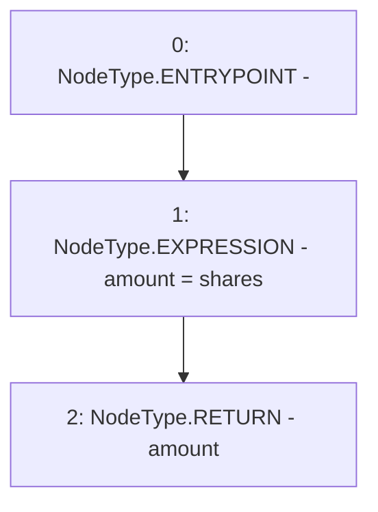

# Context: NoYield.getTokensForShares

**Contract:** `NoYield` (Inherits: ReentrancyGuard, OwnableUpgradeable, ContextUpgradeable, Initializable, IYield)
**Signature:** `getTokensForShares(uint256,address) returns (uint256)`
**Method Selector ID:** `0x59846d29`
**Visibility:** `external`
**Environment-Free:** `Yes`
**Modifiers:** None

### State Variables Interaction
- **Reads:** None
- **Writes:** None

### Environment & Verification Flags
- **Uses Foundry Cheatcodes:** No
- **Has Echidna Properties:** No

### Internal Calls Tree
- None

### External Calls / Value Transfers
- None

### Control Flow Graph (CFG)


### Source Mapping
Declared in: `contracts/yield/NoYield.sol` on lines **152** to **154**

```solidity
    function getTokensForShares(uint256 shares, address asset) external pure override returns (uint256 amount) {
        amount = shares;
    }

```
