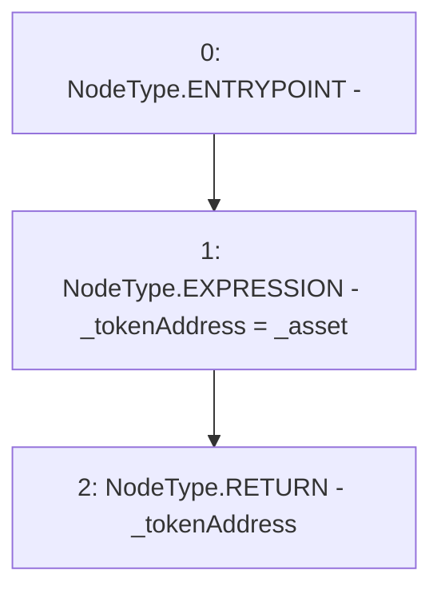

# Context: NoYield.liquidityToken

**Contract:** `NoYield` (Inherits: ReentrancyGuard, OwnableUpgradeable, ContextUpgradeable, Initializable, IYield)
**Signature:** `liquidityToken(address) returns (address)`
**Method Selector ID:** `0x1391abc7`
**Visibility:** `external`
**Environment-Free:** `Yes`
**Modifiers:** None

### State Variables Interaction
- **Reads:** None
- **Writes:** None

### Environment & Verification Flags
- **Uses Foundry Cheatcodes:** No
- **Has Echidna Properties:** No

### Internal Calls Tree
- None

### External Calls / Value Transfers
- None

### Control Flow Graph (CFG)


### Source Mapping
Declared in: `contracts/yield/NoYield.sol` on lines **53** to **55**

```solidity
    function liquidityToken(address _asset) external view override returns (address _tokenAddress) {
        _tokenAddress = _asset;
    }

```
