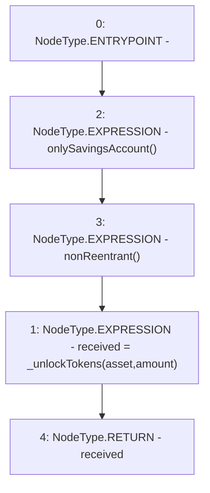

# Context: NoYield.unlockShares

**Contract:** `NoYield` (Inherits: ReentrancyGuard, OwnableUpgradeable, ContextUpgradeable, Initializable, IYield)
**Signature:** `unlockShares(address,uint256) returns (uint256)`
**Method Selector ID:** `0x76467da0`
**Visibility:** `external`
**Environment-Free:** `No (reads EVM state context)`
**Modifiers:**
- `onlySavingsAccount`
  ```solidity
  modifier onlySavingsAccount() {
          require(_msgSender() == savingsAccount, 'Invest: Only savings account can invoke');
          _;
      }
  ```
- `nonReentrant`
  ```solidity
  modifier nonReentrant() {
          // On the first call to nonReentrant, _notEntered will be true
          require(_status != _ENTERED, "ReentrancyGuard: reentrant call");
  
          // Any calls to nonReentrant after this point will fail
          _status = _ENTERED;
  
          _;
  
          // By storing the original value once again, a refund is triggered (see
          // https://eips.ethereum.org/EIPS/eip-2200)
          _status = _NOT_ENTERED;
      }
  ```

### State Variables Interaction
- **Reads:** None
- **Writes:** None

### Environment & Verification Flags
- **Uses Foundry Cheatcodes:** No
- **Has Echidna Properties:** No

### Internal Calls Tree
- None

### External Calls / Value Transfers
- None

### Control Flow Graph (CFG)


### Source Mapping
Declared in: `contracts/yield/NoYield.sol` on lines **130** to **132**

```solidity
    function unlockShares(address asset, uint256 amount) external override onlySavingsAccount nonReentrant returns (uint256 received) {
        received = _unlockTokens(asset, amount);
    }

```
