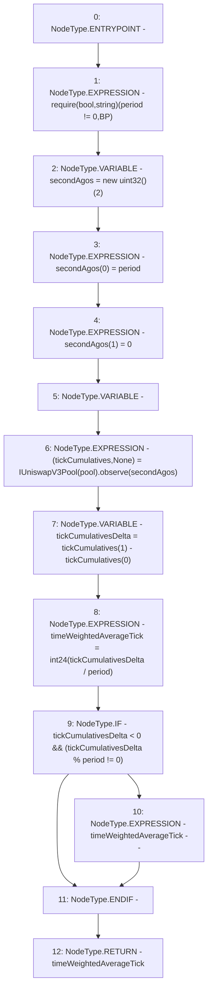

# Context: OracleLibrary.consult

**Contract:** `OracleLibrary` (Inherits: None)
**Signature:** `consult(address,uint32) returns (int24)`
**Method Selector ID:** `Internal (No Method ID)`
**Visibility:** `internal`
**Environment-Free:** `Yes`
**Modifiers:** None

### State Variables Interaction
- **Reads:** None
- **Writes:** None

### Assertion Checks & Business Requirements
- require/assert: `require(bool,string)(period != 0,BP)`

### Environment & Verification Flags
- **Uses Foundry Cheatcodes:** No
- **Has Echidna Properties:** No

### Internal Calls Tree
- None

### External Calls / Value Transfers
- `IUniswapV3Pool.TUPLE_7(int56[],uint160[]) = HIGH_LEVEL_CALL, dest:TMP_916(IUniswapV3Pool), function:observe, arguments:['secondAgos']  `

### Control Flow Graph (CFG)


### Source Mapping
Declared in: `node_modules/@uniswap/v3-periphery/contracts/libraries/OracleLibrary.sol` on lines **17** to **31**

```solidity
    function consult(address pool, uint32 period) internal view returns (int24 timeWeightedAverageTick) {
        require(period != 0, 'BP');

        uint32[] memory secondAgos = new uint32[](2);
        secondAgos[0] = period;
        secondAgos[1] = 0;

        (int56[] memory tickCumulatives, ) = IUniswapV3Pool(pool).observe(secondAgos);
        int56 tickCumulativesDelta = tickCumulatives[1] - tickCumulatives[0];

        timeWeightedAverageTick = int24(tickCumulativesDelta / period);

        // Always round to negative infinity
        if (tickCumulativesDelta < 0 && (tickCumulativesDelta % period != 0)) timeWeightedAverageTick--;
    }

```
