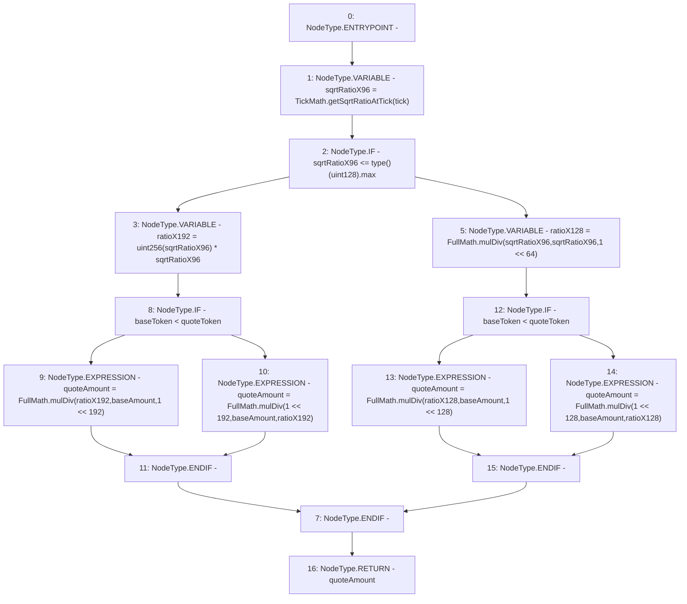

# Context: OracleLibrary.getQuoteAtTick

**Contract:** `OracleLibrary` (Inherits: None)
**Signature:** `getQuoteAtTick(int24,uint128,address,address) returns (uint256)`
**Method Selector ID:** `Internal (No Method ID)`
**Visibility:** `internal`
**Environment-Free:** `Yes`
**Modifiers:** None

### State Variables Interaction
- **Reads:** None
- **Writes:** None

### Environment & Verification Flags
- **Uses Foundry Cheatcodes:** No
- **Has Echidna Properties:** No

### Internal Calls Tree
- None

### External Calls / Value Transfers
- `FullMath.TMP_940(uint256) = LIBRARY_CALL, dest:FullMath, function:FullMath.mulDiv(uint256,uint256,uint256), arguments:['ratioX128', 'baseAmount', 'TMP_939'] `
- `TickMath.TMP_925(uint160) = LIBRARY_CALL, dest:TickMath, function:TickMath.getSqrtRatioAtTick(int24), arguments:['tick'] `
- `FullMath.TMP_935(uint256) = LIBRARY_CALL, dest:FullMath, function:FullMath.mulDiv(uint256,uint256,uint256), arguments:['ratioX192', 'baseAmount', 'TMP_934'] `
- `FullMath.TMP_937(uint256) = LIBRARY_CALL, dest:FullMath, function:FullMath.mulDiv(uint256,uint256,uint256), arguments:['TMP_936', 'baseAmount', 'ratioX192'] `
- `FullMath.TMP_942(uint256) = LIBRARY_CALL, dest:FullMath, function:FullMath.mulDiv(uint256,uint256,uint256), arguments:['TMP_941', 'baseAmount', 'ratioX128'] `
- `FullMath.TMP_932(uint256) = LIBRARY_CALL, dest:FullMath, function:FullMath.mulDiv(uint256,uint256,uint256), arguments:['sqrtRatioX96', 'sqrtRatioX96', 'TMP_931'] `

### Control Flow Graph (CFG)


### Source Mapping
Declared in: `node_modules/@uniswap/v3-periphery/contracts/libraries/OracleLibrary.sol` on lines **39** to **59**

```solidity
    function getQuoteAtTick(
        int24 tick,
        uint128 baseAmount,
        address baseToken,
        address quoteToken
    ) internal pure returns (uint256 quoteAmount) {
        uint160 sqrtRatioX96 = TickMath.getSqrtRatioAtTick(tick);

        // Calculate quoteAmount with better precision if it doesn't overflow when multiplied by itself
        if (sqrtRatioX96 <= type(uint128).max) {
            uint256 ratioX192 = uint256(sqrtRatioX96) * sqrtRatioX96;
            quoteAmount = baseToken < quoteToken
                ? FullMath.mulDiv(ratioX192, baseAmount, 1 << 192)
                : FullMath.mulDiv(1 << 192, baseAmount, ratioX192);
        } else {
            uint256 ratioX128 = FullMath.mulDiv(sqrtRatioX96, sqrtRatioX96, 1 << 64);
            quoteAmount = baseToken < quoteToken
                ? FullMath.mulDiv(ratioX128, baseAmount, 1 << 128)
                : FullMath.mulDiv(1 << 128, baseAmount, ratioX128);
        }
    }

```
