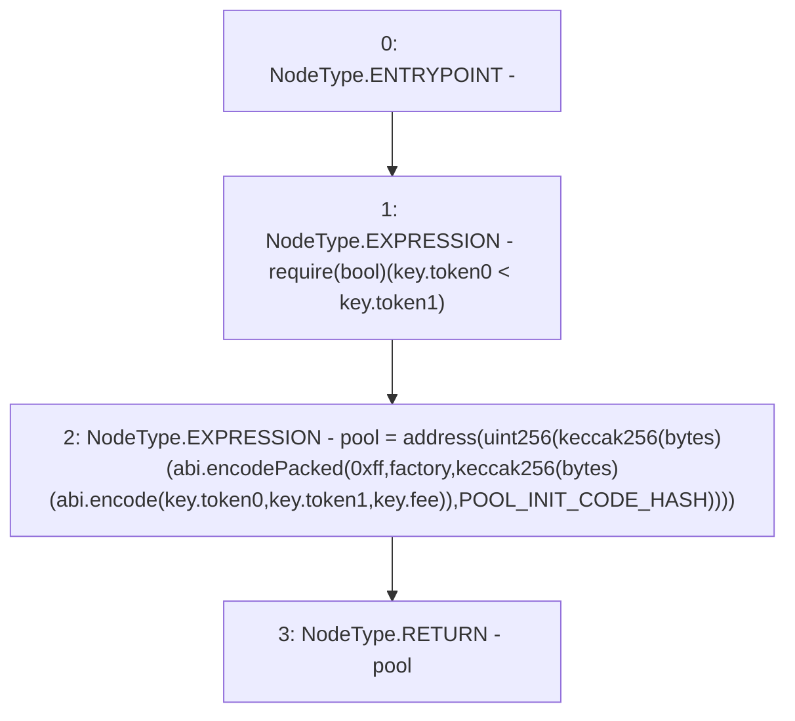

# Context: PoolAddress.computeAddress

**Contract:** `PoolAddress` (Inherits: None)
**Signature:** `computeAddress(address,PoolAddress.PoolKey) returns (address)`
**Method Selector ID:** `Internal (No Method ID)`
**Visibility:** `internal`
**Environment-Free:** `Yes`
**Modifiers:** None

### State Variables Interaction
- **Reads:** POOL_INIT_CODE_HASH
- **Writes:** None

### Assertion Checks & Business Requirements
- require/assert: `require(bool)(key.token0 < key.token1)`

### Environment & Verification Flags
- **Uses Foundry Cheatcodes:** No
- **Has Echidna Properties:** No

### Internal Calls Tree
- None

### External Calls / Value Transfers
- None

### Control Flow Graph (CFG)


### Source Mapping
Declared in: `node_modules/@uniswap/v3-periphery/contracts/libraries/PoolAddress.sol` on lines **33** to **47**

```solidity
    function computeAddress(address factory, PoolKey memory key) internal pure returns (address pool) {
        require(key.token0 < key.token1);
        pool = address(
            uint256(
                keccak256(
                    abi.encodePacked(
                        hex'ff',
                        factory,
                        keccak256(abi.encode(key.token0, key.token1, key.fee)),
                        POOL_INIT_CODE_HASH
                    )
                )
            )
        );
    }

```
