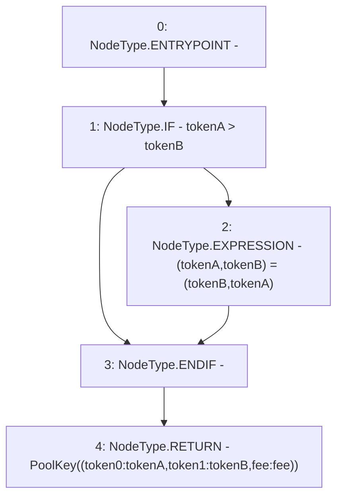

# Context: PoolAddress.getPoolKey

**Contract:** `PoolAddress` (Inherits: None)
**Signature:** `getPoolKey(address,address,uint24) returns (PoolAddress.PoolKey)`
**Method Selector ID:** `Internal (No Method ID)`
**Visibility:** `internal`
**Environment-Free:** `Yes`
**Modifiers:** None

### State Variables Interaction
- **Reads:** None
- **Writes:** None

### Environment & Verification Flags
- **Uses Foundry Cheatcodes:** No
- **Has Echidna Properties:** No

### Internal Calls Tree
- None

### External Calls / Value Transfers
- None

### Control Flow Graph (CFG)


### Source Mapping
Declared in: `node_modules/@uniswap/v3-periphery/contracts/libraries/PoolAddress.sol` on lines **20** to **27**

```solidity
    function getPoolKey(
        address tokenA,
        address tokenB,
        uint24 fee
    ) internal pure returns (PoolKey memory) {
        if (tokenA > tokenB) (tokenA, tokenB) = (tokenB, tokenA);
        return PoolKey({token0: tokenA, token1: tokenB, fee: fee});
    }

```
