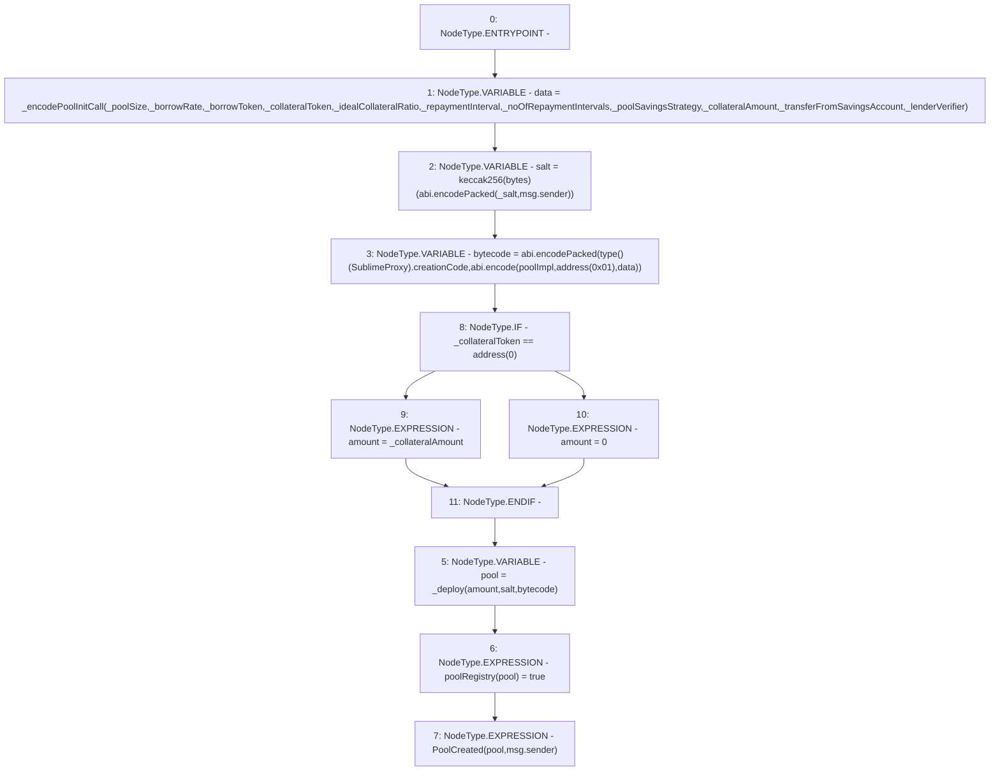

# Context: PoolFactory._createPool

**Contract:** `PoolFactory` (Inherits: IPoolFactory, OwnableUpgradeable, ContextUpgradeable, Initializable)
**Signature:** `_createPool(uint256,uint256,address,address,uint256,uint256,uint256,address,uint256,bool,bytes32,address)`
**Method Selector ID:** `Internal (No Method ID)`
**Visibility:** `internal`
**Environment-Free:** `No (reads EVM state context)`
**Modifiers:** None

### State Variables Interaction
- **Reads:** poolImpl
- **Writes:** poolRegistry

### Environment & Verification Flags
- **Uses Foundry Cheatcodes:** No
- **Has Echidna Properties:** No

### Internal Calls Tree
- None

### External Calls / Value Transfers
- `TMP_2031(bytes) = SOLIDITY_CALL abi.encodePacked()(_salt,msg.sender)`

### Control Flow Graph (CFG)


### Source Mapping
Declared in: `contracts/Pool/PoolFactory.sol` on lines **320** to **355**

```solidity
    function _createPool(
        uint256 _poolSize,
        uint256 _borrowRate,
        address _borrowToken,
        address _collateralToken,
        uint256 _idealCollateralRatio,
        uint256 _repaymentInterval,
        uint256 _noOfRepaymentIntervals,
        address _poolSavingsStrategy,
        uint256 _collateralAmount,
        bool _transferFromSavingsAccount,
        bytes32 _salt,
        address _lenderVerifier
    ) internal {
        bytes memory data = _encodePoolInitCall(
            _poolSize,
            _borrowRate,
            _borrowToken,
            _collateralToken,
            _idealCollateralRatio,
            _repaymentInterval,
            _noOfRepaymentIntervals,
            _poolSavingsStrategy,
            _collateralAmount,
            _transferFromSavingsAccount,
            _lenderVerifier
        );
        bytes32 salt = keccak256(abi.encodePacked(_salt, msg.sender));
        bytes memory bytecode = abi.encodePacked(type(SublimeProxy).creationCode, abi.encode(poolImpl, address(0x01), data));
        uint256 amount = _collateralToken == address(0) ? _collateralAmount : 0;

        address pool = _deploy(amount, salt, bytecode);

        poolRegistry[pool] = true;
        emit PoolCreated(pool, msg.sender);
    }

```
