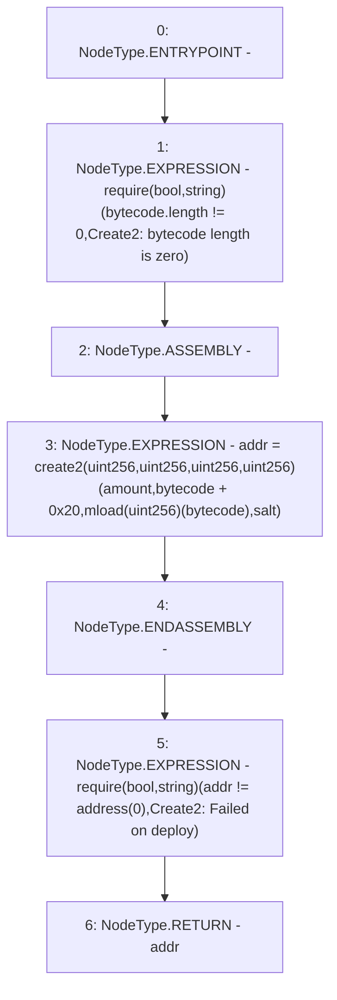

# Context: PoolFactory._deploy

**Contract:** `PoolFactory` (Inherits: IPoolFactory, OwnableUpgradeable, ContextUpgradeable, Initializable)
**Signature:** `_deploy(uint256,bytes32,bytes) returns (address)`
**Method Selector ID:** `Internal (No Method ID)`
**Visibility:** `internal`
**Environment-Free:** `Yes`
**Modifiers:** None

### State Variables Interaction
- **Reads:** None
- **Writes:** None

### Assertion Checks & Business Requirements
- require/assert: `require(bool,string)(bytecode.length != 0,Create2: bytecode length is zero)`
- require/assert: `require(bool,string)(addr != address(0),Create2: Failed on deploy)`

### Environment & Verification Flags
- **Uses Foundry Cheatcodes:** No
- **Has Echidna Properties:** No

### Internal Calls Tree
- None

### External Calls / Value Transfers
- None

### Control Flow Graph (CFG)


### Source Mapping
Declared in: `contracts/Pool/PoolFactory.sol` on lines **404** to **415**

```solidity
    function _deploy(
        uint256 amount,
        bytes32 salt,
        bytes memory bytecode
    ) internal returns (address addr) {
        require(bytecode.length != 0, 'Create2: bytecode length is zero');
        // solhint-disable-next-line no-inline-assembly
        assembly {
            addr := create2(amount, add(bytecode, 0x20), mload(bytecode), salt)
        }
        require(addr != address(0), 'Create2: Failed on deploy');
    }

```
