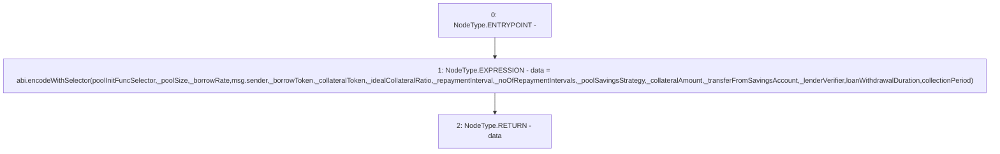

# Context: PoolFactory._encodePoolInitCall

**Contract:** `PoolFactory` (Inherits: IPoolFactory, OwnableUpgradeable, ContextUpgradeable, Initializable)
**Signature:** `_encodePoolInitCall(uint256,uint256,address,address,uint256,uint256,uint256,address,uint256,bool,address) returns (bytes)`
**Method Selector ID:** `Internal (No Method ID)`
**Visibility:** `internal`
**Environment-Free:** `No (reads EVM state context)`
**Modifiers:** None

### State Variables Interaction
- **Reads:** collectionPeriod, loanWithdrawalDuration, poolInitFuncSelector
- **Writes:** None

### Environment & Verification Flags
- **Uses Foundry Cheatcodes:** No
- **Has Echidna Properties:** No

### Internal Calls Tree
- None

### External Calls / Value Transfers
- `TMP_2041(bytes) = SOLIDITY_CALL abi.encodeWithSelector()(poolInitFuncSelector,_poolSize,_borrowRate,msg.sender,_borrowToken,_collateralToken,_idealCollateralRatio,_repaymentInterval,_noOfRepaymentIntervals,_poolSavingsStrategy,_collateralAmount,_transferFromSavingsAccount,_lenderVerifier,loanWithdrawalDuration,collectionPeriod)`

### Control Flow Graph (CFG)


### Source Mapping
Declared in: `contracts/Pool/PoolFactory.sol` on lines **358** to **388**

```solidity
    function _encodePoolInitCall(
        uint256 _poolSize,
        uint256 _borrowRate,
        address _borrowToken,
        address _collateralToken,
        uint256 _idealCollateralRatio,
        uint256 _repaymentInterval,
        uint256 _noOfRepaymentIntervals,
        address _poolSavingsStrategy,
        uint256 _collateralAmount,
        bool _transferFromSavingsAccount,
        address _lenderVerifier
    ) internal view returns (bytes memory data) {
        data = abi.encodeWithSelector(
            poolInitFuncSelector,
            _poolSize,
            _borrowRate,
            msg.sender,
            _borrowToken,
            _collateralToken,
            _idealCollateralRatio,
            _repaymentInterval,
            _noOfRepaymentIntervals,
            _poolSavingsStrategy,
            _collateralAmount,
            _transferFromSavingsAccount,
            _lenderVerifier,
            loanWithdrawalDuration,
            collectionPeriod
        );
    }

```
