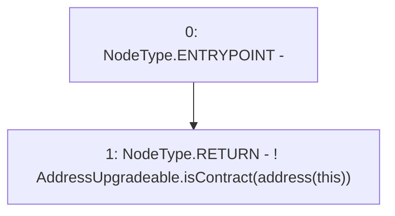

# Context: PoolFactory._isConstructor

**Contract:** `PoolFactory` (Inherits: IPoolFactory, OwnableUpgradeable, ContextUpgradeable, Initializable)
**Signature:** `_isConstructor() returns (bool)`
**Method Selector ID:** `Internal (No Method ID)`
**Visibility:** `private`
**Environment-Free:** `Yes`
**Modifiers:** None

### State Variables Interaction
- **Reads:** None
- **Writes:** None

### Environment & Verification Flags
- **Uses Foundry Cheatcodes:** No
- **Has Echidna Properties:** No

### Internal Calls Tree
- None

### External Calls / Value Transfers
- `AddressUpgradeable.TMP_1980(bool) = LIBRARY_CALL, dest:AddressUpgradeable, function:AddressUpgradeable.isContract(address), arguments:['TMP_1979'] `

### Control Flow Graph (CFG)


### Source Mapping
Declared in: `node_modules/@openzeppelin/contracts-upgradeable/proxy/Initializable.sol` on lines **52** to **54**

```solidity
    function _isConstructor() private view returns (bool) {
        return !AddressUpgradeable.isContract(address(this));
    }

```
