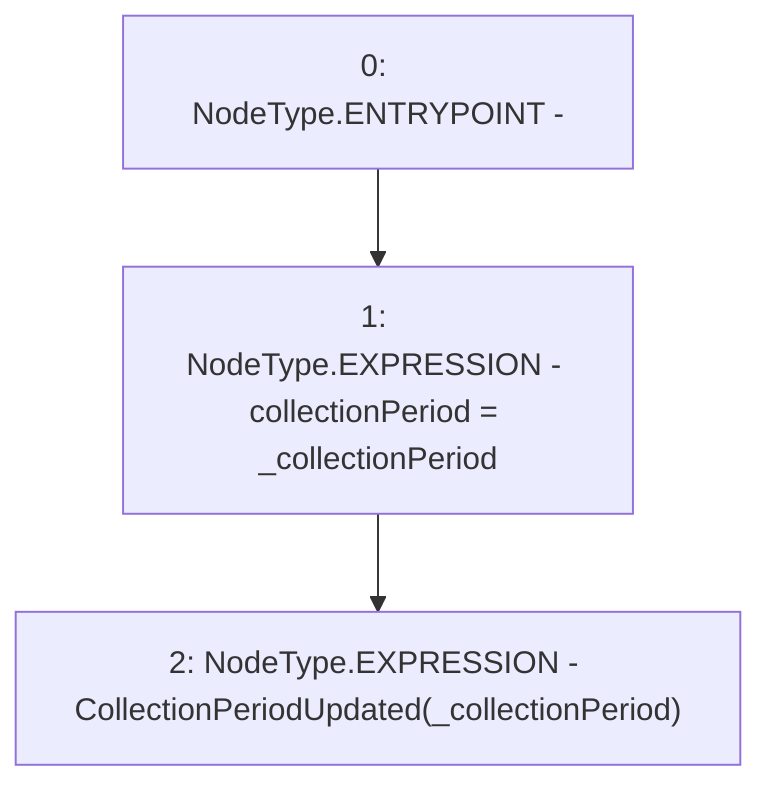

# Context: PoolFactory._updateCollectionPeriod

**Contract:** `PoolFactory` (Inherits: IPoolFactory, OwnableUpgradeable, ContextUpgradeable, Initializable)
**Signature:** `_updateCollectionPeriod(uint256)`
**Method Selector ID:** `Internal (No Method ID)`
**Visibility:** `internal`
**Environment-Free:** `Yes`
**Modifiers:** None

### State Variables Interaction
- **Reads:** None
- **Writes:** collectionPeriod

### Environment & Verification Flags
- **Uses Foundry Cheatcodes:** No
- **Has Echidna Properties:** No

### Internal Calls Tree
- None

### External Calls / Value Transfers
- None

### Control Flow Graph (CFG)


### Source Mapping
Declared in: `contracts/Pool/PoolFactory.sol` on lines **592** to **595**

```solidity
    function _updateCollectionPeriod(uint256 _collectionPeriod) internal {
        collectionPeriod = _collectionPeriod;
        emit CollectionPeriodUpdated(_collectionPeriod);
    }

```
