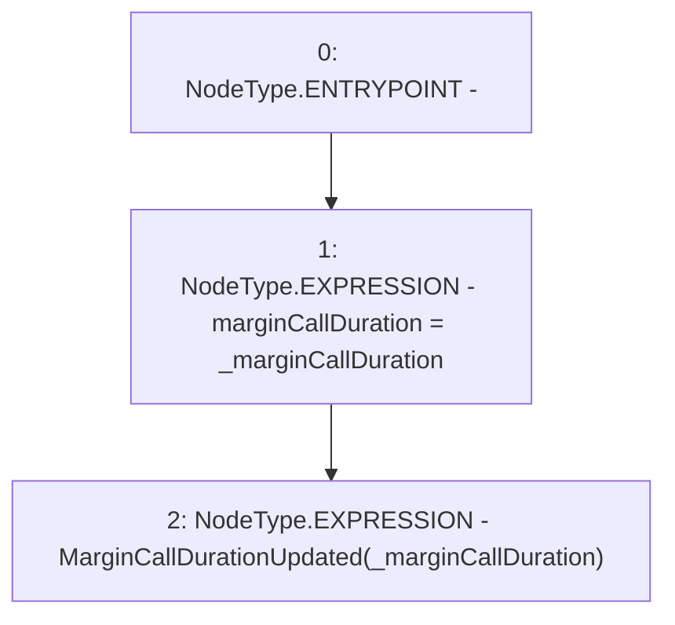

# Context: PoolFactory._updateMarginCallDuration

**Contract:** `PoolFactory` (Inherits: IPoolFactory, OwnableUpgradeable, ContextUpgradeable, Initializable)
**Signature:** `_updateMarginCallDuration(uint256)`
**Method Selector ID:** `Internal (No Method ID)`
**Visibility:** `internal`
**Environment-Free:** `Yes`
**Modifiers:** None

### State Variables Interaction
- **Reads:** None
- **Writes:** marginCallDuration

### Environment & Verification Flags
- **Uses Foundry Cheatcodes:** No
- **Has Echidna Properties:** No

### Internal Calls Tree
- None

### External Calls / Value Transfers
- None

### Control Flow Graph (CFG)


### Source Mapping
Declared in: `contracts/Pool/PoolFactory.sol` on lines **618** to **621**

```solidity
    function _updateMarginCallDuration(uint256 _marginCallDuration) internal {
        marginCallDuration = _marginCallDuration;
        emit MarginCallDurationUpdated(_marginCallDuration);
    }

```
