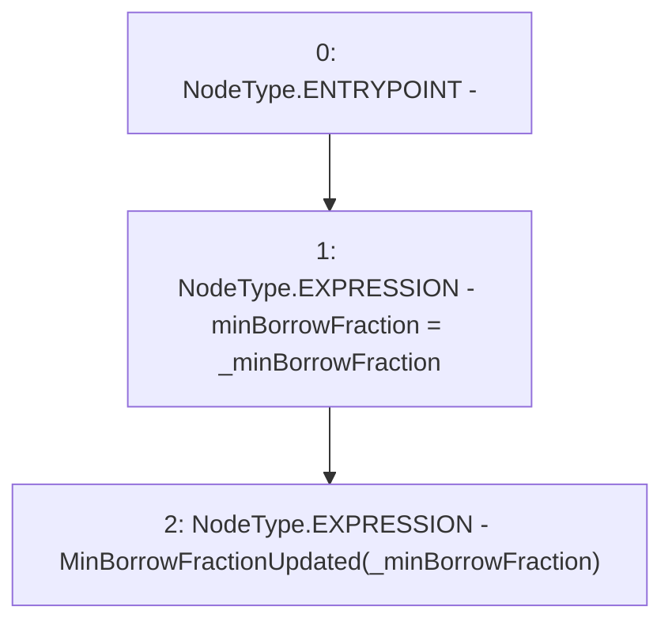

# Context: PoolFactory._updateMinBorrowFraction

**Contract:** `PoolFactory` (Inherits: IPoolFactory, OwnableUpgradeable, ContextUpgradeable, Initializable)
**Signature:** `_updateMinBorrowFraction(uint256)`
**Method Selector ID:** `Internal (No Method ID)`
**Visibility:** `internal`
**Environment-Free:** `Yes`
**Modifiers:** None

### State Variables Interaction
- **Reads:** None
- **Writes:** minBorrowFraction

### Environment & Verification Flags
- **Uses Foundry Cheatcodes:** No
- **Has Echidna Properties:** No

### Internal Calls Tree
- None

### External Calls / Value Transfers
- None

### Control Flow Graph (CFG)


### Source Mapping
Declared in: `contracts/Pool/PoolFactory.sol` on lines **631** to **634**

```solidity
    function _updateMinBorrowFraction(uint256 _minBorrowFraction) internal {
        minBorrowFraction = _minBorrowFraction;
        emit MinBorrowFractionUpdated(_minBorrowFraction);
    }

```
