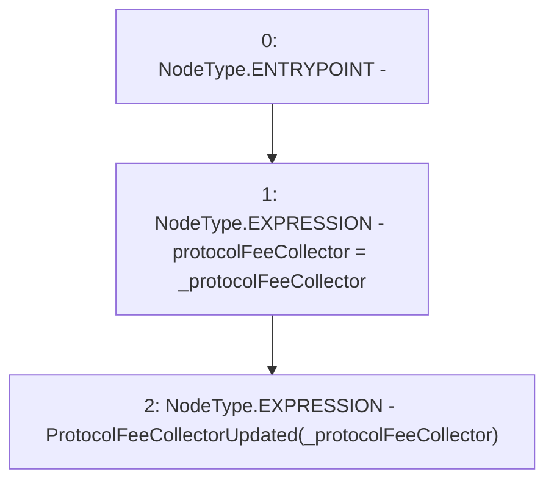

# Context: PoolFactory._updateProtocolFeeCollector

**Contract:** `PoolFactory` (Inherits: IPoolFactory, OwnableUpgradeable, ContextUpgradeable, Initializable)
**Signature:** `_updateProtocolFeeCollector(address)`
**Method Selector ID:** `Internal (No Method ID)`
**Visibility:** `internal`
**Environment-Free:** `Yes`
**Modifiers:** None

### State Variables Interaction
- **Reads:** None
- **Writes:** protocolFeeCollector

### Environment & Verification Flags
- **Uses Foundry Cheatcodes:** No
- **Has Echidna Properties:** No

### Internal Calls Tree
- None

### External Calls / Value Transfers
- None

### Control Flow Graph (CFG)


### Source Mapping
Declared in: `contracts/Pool/PoolFactory.sol` on lines **683** to **686**

```solidity
    function _updateProtocolFeeCollector(address _protocolFeeCollector) internal {
        protocolFeeCollector = _protocolFeeCollector;
        emit ProtocolFeeCollectorUpdated(_protocolFeeCollector);
    }

```
