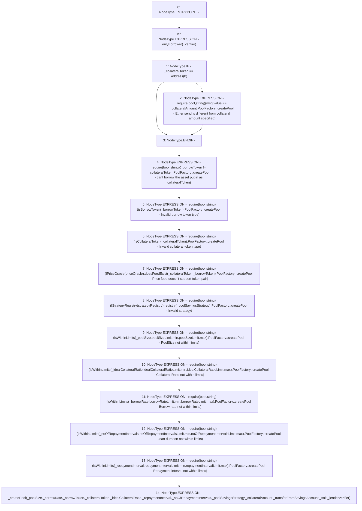

# Context: PoolFactory.createPool

**Contract:** `PoolFactory` (Inherits: IPoolFactory, OwnableUpgradeable, ContextUpgradeable, Initializable)
**Signature:** `createPool(uint256,uint256,address,address,uint256,uint256,uint256,address,uint256,bool,bytes32,address,address)`
**Method Selector ID:** `0x61ae73a9`
**Visibility:** `external`
**Environment-Free:** `No (reads EVM state context)`
**Modifiers:**
- `onlyBorrower`
  ```solidity
  modifier onlyBorrower(address _verifier) {
          require(
              IVerification(userRegistry).isUser(msg.sender, _verifier),
              'PoolFactory::onlyBorrower - Only a valid Borrower can create Pool'
          );
          _;
      }
  ```

### State Variables Interaction
- **Reads:** borrowRateLimit, idealCollateralRatioLimit, isBorrowToken, isCollateralToken, noOfRepaymentIntervalsLimit, poolSizeLimit, priceOracle, repaymentIntervalLimit, strategyRegistry
- **Writes:** None

### Assertion Checks & Business Requirements
- require/assert: `require(bool,string)(msg.value == _collateralAmount,PoolFactory::createPool - Ether send is different from collateral amount specified)`
- require/assert: `require(bool,string)(_borrowToken != _collateralToken,PoolFactory::createPool - cant borrow the asset put in as collateralToken)`
- require/assert: `require(bool,string)(isBorrowToken[_borrowToken],PoolFactory::createPool - Invalid borrow token type)`
- require/assert: `require(bool,string)(isCollateralToken[_collateralToken],PoolFactory::createPool - Invalid collateral token type)`
- require/assert: `require(bool,string)(IPriceOracle(priceOracle).doesFeedExist(_collateralToken,_borrowToken),PoolFactory::createPool - Price feed doesn't support token pair)`
- require/assert: `require(bool,string)(IStrategyRegistry(strategyRegistry).registry(_poolSavingsStrategy),PoolFactory::createPool - Invalid strategy)`
- require/assert: `require(bool,string)(isWithinLimits(_poolSize,poolSizeLimit.min,poolSizeLimit.max),PoolFactory::createPool - PoolSize not within limits)`
- require/assert: `require(bool,string)(isWithinLimits(_idealCollateralRatio,idealCollateralRatioLimit.min,idealCollateralRatioLimit.max),PoolFactory::createPool - Collateral Ratio not within limits)`
- require/assert: `require(bool,string)(isWithinLimits(_borrowRate,borrowRateLimit.min,borrowRateLimit.max),PoolFactory::createPool - Borrow rate not within limits)`
- require/assert: `require(bool,string)(isWithinLimits(_noOfRepaymentIntervals,noOfRepaymentIntervalsLimit.min,noOfRepaymentIntervalsLimit.max),PoolFactory::createPool - Loan duration not within limits)`
- require/assert: `require(bool,string)(isWithinLimits(_repaymentInterval,repaymentIntervalLimit.min,repaymentIntervalLimit.max),PoolFactory::createPool - Repayment interval not within limits)`

### Environment & Verification Flags
- **Uses Foundry Cheatcodes:** No
- **Has Echidna Properties:** No

### Internal Calls Tree
- None

### External Calls / Value Transfers
- `TMP_2007(None) = SOLIDITY_CALL require(bool,string)(TMP_2006,PoolFactory::createPool - Ether send is different from collateral amount specified)`
- `IStrategyRegistry.TMP_2016(bool) = HIGH_LEVEL_CALL, dest:TMP_2015(IStrategyRegistry), function:registry, arguments:['_poolSavingsStrategy']  `
- `IPriceOracle.TMP_2013(bool) = HIGH_LEVEL_CALL, dest:TMP_2012(IPriceOracle), function:doesFeedExist, arguments:['_collateralToken', '_borrowToken']  `

### Control Flow Graph (CFG)


### Source Mapping
Declared in: `contracts/Pool/PoolFactory.sol` on lines **260** to **317**

```solidity
    function createPool(
        uint256 _poolSize,
        uint256 _borrowRate,
        address _borrowToken,
        address _collateralToken,
        uint256 _idealCollateralRatio,
        uint256 _repaymentInterval,
        uint256 _noOfRepaymentIntervals,
        address _poolSavingsStrategy,
        uint256 _collateralAmount,
        bool _transferFromSavingsAccount,
        bytes32 _salt,
        address _verifier,
        address _lenderVerifier
    ) external payable onlyBorrower(_verifier) {
        if (_collateralToken == address(0)) {
            require(msg.value == _collateralAmount, 'PoolFactory::createPool - Ether send is different from collateral amount specified');
        }
        require(_borrowToken != _collateralToken, 'PoolFactory::createPool - cant borrow the asset put in as collateralToken');
        require(isBorrowToken[_borrowToken], 'PoolFactory::createPool - Invalid borrow token type');
        require(isCollateralToken[_collateralToken], 'PoolFactory::createPool - Invalid collateral token type');
        require(
            IPriceOracle(priceOracle).doesFeedExist(_collateralToken, _borrowToken),
            "PoolFactory::createPool - Price feed doesn't support token pair"
        );
        require(IStrategyRegistry(strategyRegistry).registry(_poolSavingsStrategy), 'PoolFactory::createPool - Invalid strategy');
        require(isWithinLimits(_poolSize, poolSizeLimit.min, poolSizeLimit.max), 'PoolFactory::createPool - PoolSize not within limits');
        require(
            isWithinLimits(_idealCollateralRatio, idealCollateralRatioLimit.min, idealCollateralRatioLimit.max),
            'PoolFactory::createPool - Collateral Ratio not within limits'
        );
        require(
            isWithinLimits(_borrowRate, borrowRateLimit.min, borrowRateLimit.max),
            'PoolFactory::createPool - Borrow rate not within limits'
        );
        require(
            isWithinLimits(_noOfRepaymentIntervals, noOfRepaymentIntervalsLimit.min, noOfRepaymentIntervalsLimit.max),
            'PoolFactory::createPool - Loan duration not within limits'
        );
        require(
            isWithinLimits(_repaymentInterval, repaymentIntervalLimit.min, repaymentIntervalLimit.max),
            'PoolFactory::createPool - Repayment interval not within limits'
        );
        _createPool(
            _poolSize,
            _borrowRate,
            _borrowToken,
            _collateralToken,
            _idealCollateralRatio,
            _repaymentInterval,
            _noOfRepaymentIntervals,
            _poolSavingsStrategy,
            _collateralAmount,
            _transferFromSavingsAccount,
            _salt,
            _lenderVerifier
        );
    }

```
