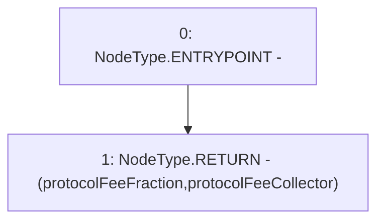

# Context: PoolFactory.getProtocolFeeData

**Contract:** `PoolFactory` (Inherits: IPoolFactory, OwnableUpgradeable, ContextUpgradeable, Initializable)
**Signature:** `getProtocolFeeData() returns (uint256, address)`
**Method Selector ID:** `0x7bad5207`
**Visibility:** `external`
**Environment-Free:** `Yes`
**Modifiers:** None

### State Variables Interaction
- **Reads:** protocolFeeCollector, protocolFeeFraction
- **Writes:** None

### Environment & Verification Flags
- **Uses Foundry Cheatcodes:** No
- **Has Echidna Properties:** No

### Internal Calls Tree
- None

### External Calls / Value Transfers
- None

### Control Flow Graph (CFG)


### Source Mapping
Declared in: `contracts/Pool/PoolFactory.sol` on lines **743** to **745**

```solidity
    function getProtocolFeeData() external view override returns (uint256, address) {
        return (protocolFeeFraction, protocolFeeCollector);
    }

```
