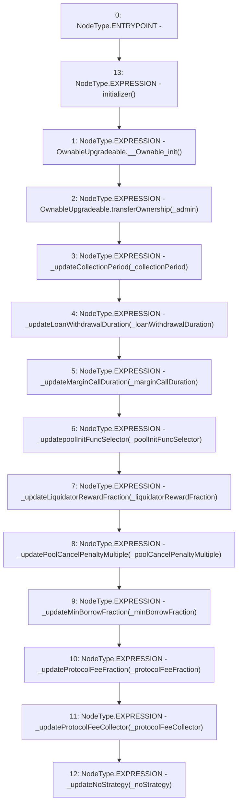

# Context: PoolFactory.initialize

**Contract:** `PoolFactory` (Inherits: IPoolFactory, OwnableUpgradeable, ContextUpgradeable, Initializable)
**Signature:** `initialize(address,uint256,uint256,uint256,bytes4,uint256,uint256,uint256,uint256,address,address)`
**Method Selector ID:** `0xd3f09658`
**Visibility:** `external`
**Environment-Free:** `No (reads EVM state context)`
**Modifiers:**
- `initializer`
  ```solidity
  modifier initializer() {
          require(_initializing || _isConstructor() || !_initialized, "Initializable: contract is already initialized");
  
          bool isTopLevelCall = !_initializing;
          if (isTopLevelCall) {
              _initializing = true;
              _initialized = true;
          }
  
          _;
  
          if (isTopLevelCall) {
              _initializing = false;
          }
      }
  ```

### State Variables Interaction
- **Reads:** None
- **Writes:** None

### Environment & Verification Flags
- **Uses Foundry Cheatcodes:** No
- **Has Echidna Properties:** No

### Internal Calls Tree
- None

### External Calls / Value Transfers
- None

### Control Flow Graph (CFG)


### Source Mapping
Declared in: `contracts/Pool/PoolFactory.sol` on lines **188** to **215**

```solidity
    function initialize(
        address _admin,
        uint256 _collectionPeriod,
        uint256 _loanWithdrawalDuration,
        uint256 _marginCallDuration,
        bytes4 _poolInitFuncSelector,
        uint256 _liquidatorRewardFraction,
        uint256 _poolCancelPenaltyMultiple,
        uint256 _minBorrowFraction,
        uint256 _protocolFeeFraction,
        address _protocolFeeCollector,
        address _noStrategy
    ) external initializer {
        {
            OwnableUpgradeable.__Ownable_init();
            OwnableUpgradeable.transferOwnership(_admin);
        }
        _updateCollectionPeriod(_collectionPeriod);
        _updateLoanWithdrawalDuration(_loanWithdrawalDuration);
        _updateMarginCallDuration(_marginCallDuration);
        _updatepoolInitFuncSelector(_poolInitFuncSelector);
        _updateLiquidatorRewardFraction(_liquidatorRewardFraction);
        _updatePoolCancelPenaltyMultiple(_poolCancelPenaltyMultiple);
        _updateMinBorrowFraction(_minBorrowFraction);
        _updateProtocolFeeFraction(_protocolFeeFraction);
        _updateProtocolFeeCollector(_protocolFeeCollector);
        _updateNoStrategy(_noStrategy);
    }

```
