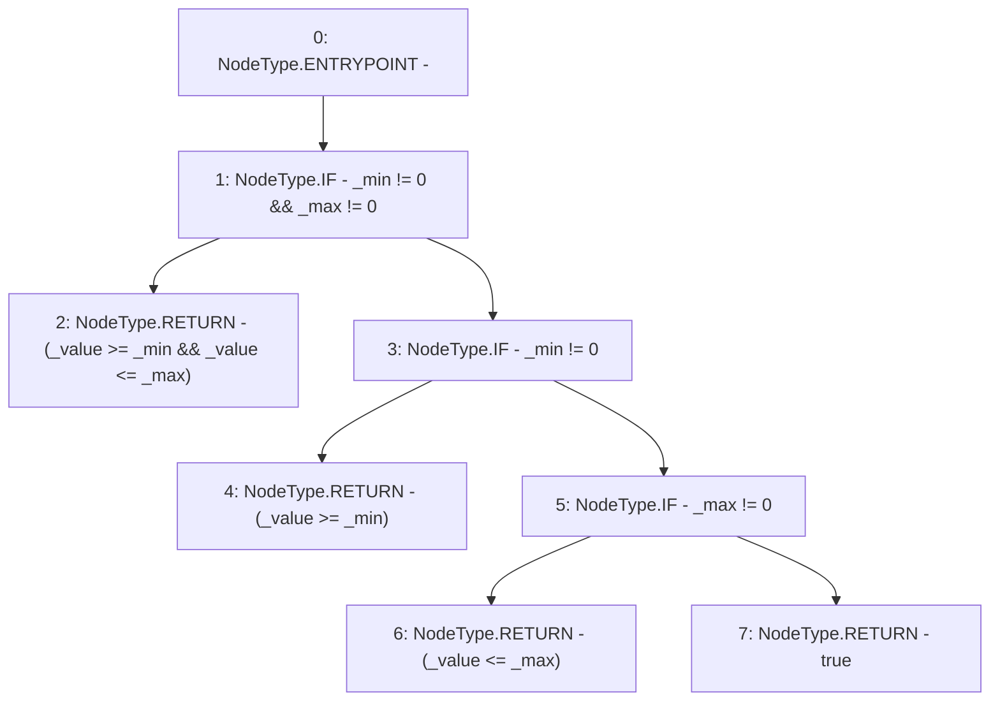

# Context: PoolFactory.isWithinLimits

**Contract:** `PoolFactory` (Inherits: IPoolFactory, OwnableUpgradeable, ContextUpgradeable, Initializable)
**Signature:** `isWithinLimits(uint256,uint256,uint256) returns (bool)`
**Method Selector ID:** `Internal (No Method ID)`
**Visibility:** `internal`
**Environment-Free:** `Yes`
**Modifiers:** None

### State Variables Interaction
- **Reads:** None
- **Writes:** None

### Environment & Verification Flags
- **Uses Foundry Cheatcodes:** No
- **Has Echidna Properties:** No

### Internal Calls Tree
- None

### External Calls / Value Transfers
- None

### Control Flow Graph (CFG)


### Source Mapping
Declared in: `contracts/Pool/PoolFactory.sol` on lines **423** to **437**

```solidity
    function isWithinLimits(
        uint256 _value,
        uint256 _min,
        uint256 _max
    ) internal pure returns (bool) {
        if (_min != 0 && _max != 0) {
            return (_value >= _min && _value <= _max);
        } else if (_min != 0) {
            return (_value >= _min);
        } else if (_max != 0) {
            return (_value <= _max);
        } else {
            return true;
        }
    }

```
