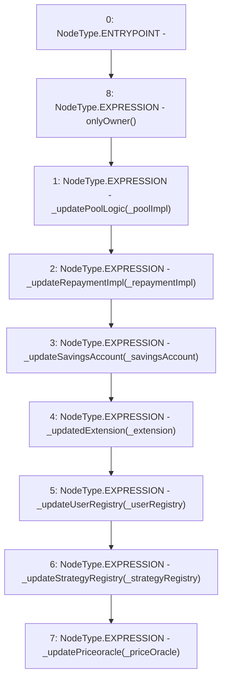

# Context: PoolFactory.setImplementations

**Contract:** `PoolFactory` (Inherits: IPoolFactory, OwnableUpgradeable, ContextUpgradeable, Initializable)
**Signature:** `setImplementations(address,address,address,address,address,address,address)`
**Method Selector ID:** `0xcea2490c`
**Visibility:** `external`
**Environment-Free:** `No (reads EVM state context)`
**Modifiers:**
- `onlyOwner`
  ```solidity
  modifier onlyOwner() {
          require(owner() == _msgSender(), "Ownable: caller is not the owner");
          _;
      }
  ```

### State Variables Interaction
- **Reads:** None
- **Writes:** None

### Environment & Verification Flags
- **Uses Foundry Cheatcodes:** No
- **Has Echidna Properties:** No

### Internal Calls Tree
- None

### External Calls / Value Transfers
- None

### Control Flow Graph (CFG)


### Source Mapping
Declared in: `contracts/Pool/PoolFactory.sol` on lines **228** to **244**

```solidity
    function setImplementations(
        address _poolImpl,
        address _repaymentImpl,
        address _userRegistry,
        address _strategyRegistry,
        address _priceOracle,
        address _savingsAccount,
        address _extension
    ) external onlyOwner {
        _updatePoolLogic(_poolImpl);
        _updateRepaymentImpl(_repaymentImpl);
        _updateSavingsAccount(_savingsAccount);
        _updatedExtension(_extension);
        _updateUserRegistry(_userRegistry);
        _updateStrategyRegistry(_strategyRegistry);
        _updatePriceoracle(_priceOracle);
    }

```
