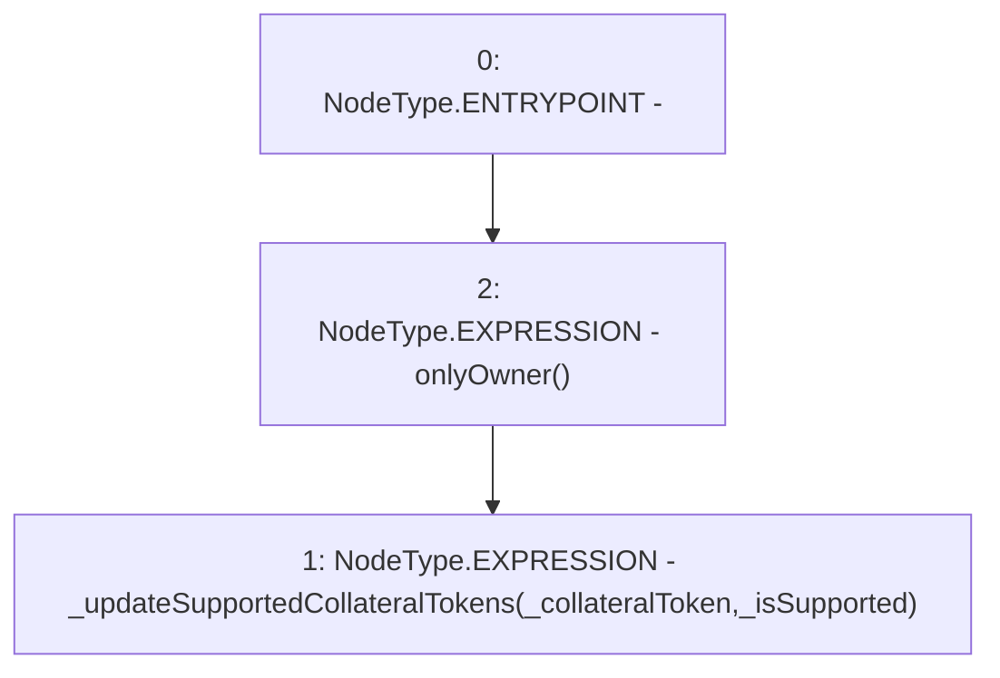

# Context: PoolFactory.updateSupportedCollateralTokens

**Contract:** `PoolFactory` (Inherits: IPoolFactory, OwnableUpgradeable, ContextUpgradeable, Initializable)
**Signature:** `updateSupportedCollateralTokens(address,bool)`
**Method Selector ID:** `0x7d3edfee`
**Visibility:** `external`
**Environment-Free:** `No (reads EVM state context)`
**Modifiers:**
- `onlyOwner`
  ```solidity
  modifier onlyOwner() {
          require(owner() == _msgSender(), "Ownable: caller is not the owner");
          _;
      }
  ```

### State Variables Interaction
- **Reads:** None
- **Writes:** None

### Environment & Verification Flags
- **Uses Foundry Cheatcodes:** No
- **Has Echidna Properties:** No

### Internal Calls Tree
- None

### External Calls / Value Transfers
- None

### Control Flow Graph (CFG)


### Source Mapping
Declared in: `contracts/Pool/PoolFactory.sol` on lines **458** to **460**

```solidity
    function updateSupportedCollateralTokens(address _collateralToken, bool _isSupported) external onlyOwner {
        _updateSupportedCollateralTokens(_collateralToken, _isSupported);
    }

```
