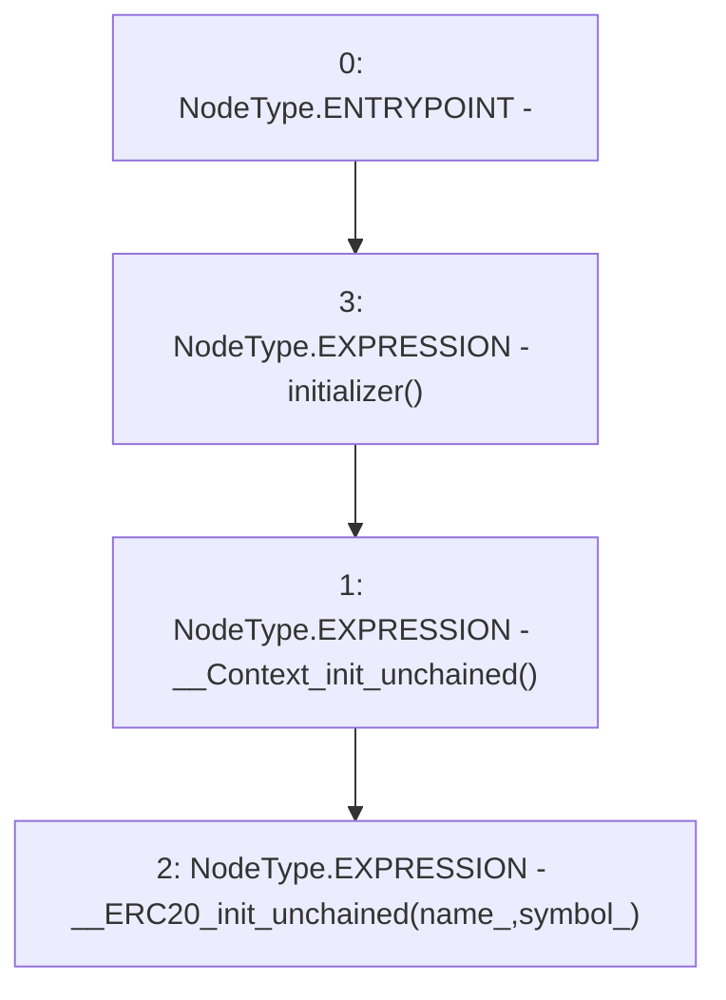

# Context: Pool.__ERC20_init

**Contract:** `Pool` (Inherits: ReentrancyGuard, IPool, ERC20PausableUpgradeable, PausableUpgradeable, ERC20Upgradeable, IERC20Upgradeable, ContextUpgradeable, Initializable)
**Signature:** `__ERC20_init(string,string)`
**Method Selector ID:** `Internal (No Method ID)`
**Visibility:** `internal`
**Environment-Free:** `Yes`
**Modifiers:**
- `initializer`
  ```solidity
  modifier initializer() {
          require(_initializing || _isConstructor() || !_initialized, "Initializable: contract is already initialized");
  
          bool isTopLevelCall = !_initializing;
          if (isTopLevelCall) {
              _initializing = true;
              _initialized = true;
          }
  
          _;
  
          if (isTopLevelCall) {
              _initializing = false;
          }
      }
  ```

### State Variables Interaction
- **Reads:** None
- **Writes:** None

### Environment & Verification Flags
- **Uses Foundry Cheatcodes:** No
- **Has Echidna Properties:** No

### Internal Calls Tree
- None

### External Calls / Value Transfers
- None

### Control Flow Graph (CFG)


### Source Mapping
Declared in: `node_modules/@openzeppelin/contracts-upgradeable/token/ERC20/ERC20Upgradeable.sol` on lines **56** to **59**

```solidity
    function __ERC20_init(string memory name_, string memory symbol_) internal initializer {
        __Context_init_unchained();
        __ERC20_init_unchained(name_, symbol_);
    }

```
