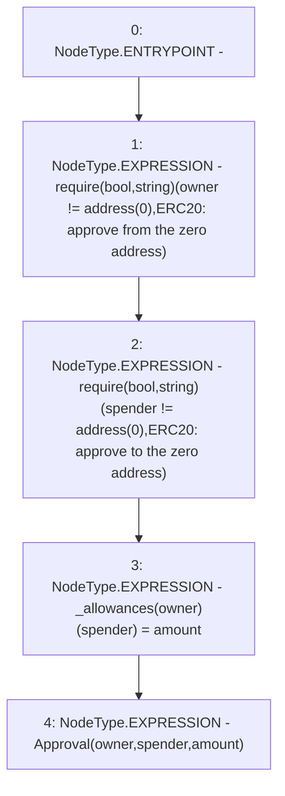

# Context: Pool._approve

**Contract:** `Pool` (Inherits: ReentrancyGuard, IPool, ERC20PausableUpgradeable, PausableUpgradeable, ERC20Upgradeable, IERC20Upgradeable, ContextUpgradeable, Initializable)
**Signature:** `_approve(address,address,uint256)`
**Method Selector ID:** `Internal (No Method ID)`
**Visibility:** `internal`
**Environment-Free:** `Yes`
**Modifiers:** None

### State Variables Interaction
- **Reads:** None
- **Writes:** _allowances

### Assertion Checks & Business Requirements
- require/assert: `require(bool,string)(owner != address(0),ERC20: approve from the zero address)`
- require/assert: `require(bool,string)(spender != address(0),ERC20: approve to the zero address)`

### Environment & Verification Flags
- **Uses Foundry Cheatcodes:** No
- **Has Echidna Properties:** No

### Internal Calls Tree
- None

### External Calls / Value Transfers
- None

### Control Flow Graph (CFG)


### Source Mapping
Declared in: `node_modules/@openzeppelin/contracts-upgradeable/token/ERC20/ERC20Upgradeable.sol` on lines **278** to **284**

```solidity
    function _approve(address owner, address spender, uint256 amount) internal virtual {
        require(owner != address(0), "ERC20: approve from the zero address");
        require(spender != address(0), "ERC20: approve to the zero address");

        _allowances[owner][spender] = amount;
        emit Approval(owner, spender, amount);
    }

```
