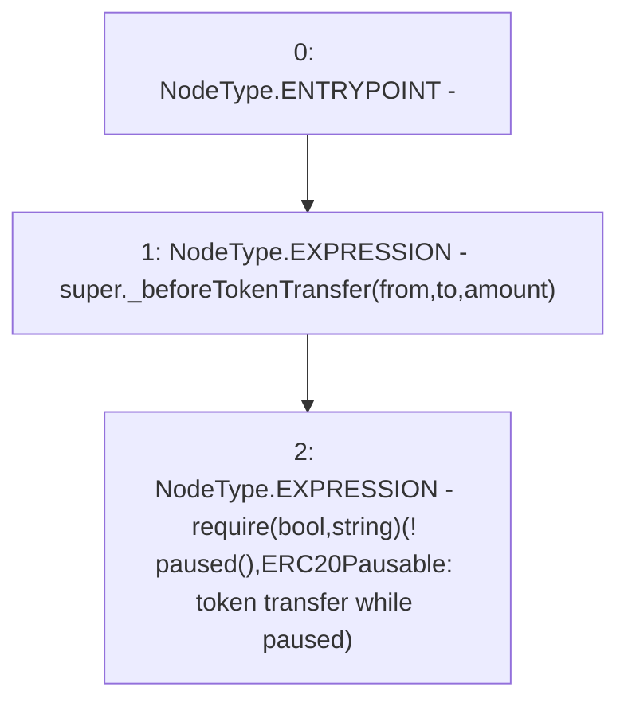

# Context: Pool._beforeTokenTransfer

**Contract:** `Pool` (Inherits: ReentrancyGuard, IPool, ERC20PausableUpgradeable, PausableUpgradeable, ERC20Upgradeable, IERC20Upgradeable, ContextUpgradeable, Initializable)
**Signature:** `_beforeTokenTransfer(address,address,uint256)`
**Method Selector ID:** `Internal (No Method ID)`
**Visibility:** `internal`
**Environment-Free:** `Yes`
**Modifiers:** None

### State Variables Interaction
- **Reads:** None
- **Writes:** None

### Assertion Checks & Business Requirements
- require/assert: `require(bool,string)(! paused(),ERC20Pausable: token transfer while paused)`

### Environment & Verification Flags
- **Uses Foundry Cheatcodes:** No
- **Has Echidna Properties:** No

### Internal Calls Tree
- None

### External Calls / Value Transfers
- `TMP_1428(None) = SOLIDITY_CALL require(bool,string)(TMP_1427,ERC20Pausable: token transfer while paused)`

### Control Flow Graph (CFG)


### Source Mapping
Declared in: `node_modules/@openzeppelin/contracts-upgradeable/token/ERC20/ERC20PausableUpgradeable.sol` on lines **32** to **36**

```solidity
    function _beforeTokenTransfer(address from, address to, uint256 amount) internal virtual override {
        super._beforeTokenTransfer(from, to, amount);

        require(!paused(), "ERC20Pausable: token transfer while paused");
    }

```
