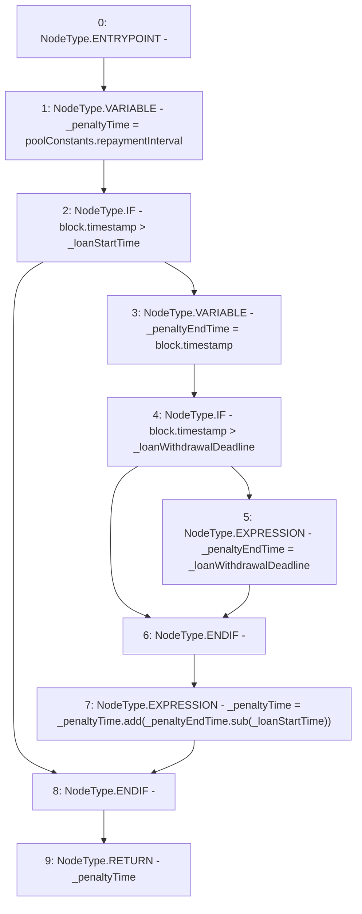

# Context: Pool._calculatePenaltyTime

**Contract:** `Pool` (Inherits: ReentrancyGuard, IPool, ERC20PausableUpgradeable, PausableUpgradeable, ERC20Upgradeable, IERC20Upgradeable, ContextUpgradeable, Initializable)
**Signature:** `_calculatePenaltyTime(uint256,uint256) returns (uint256)`
**Method Selector ID:** `Internal (No Method ID)`
**Visibility:** `internal`
**Environment-Free:** `No (reads EVM state context)`
**Modifiers:** None

### State Variables Interaction
- **Reads:** poolConstants
- **Writes:** None

### Environment & Verification Flags
- **Uses Foundry Cheatcodes:** No
- **Has Echidna Properties:** No

### Internal Calls Tree
- None

### External Calls / Value Transfers
- `SafeMathUpgradeable.TMP_1678(uint256) = LIBRARY_CALL, dest:SafeMathUpgradeable, function:SafeMathUpgradeable.sub(uint256,uint256), arguments:['_penaltyEndTime', '_loanStartTime'] `
- `SafeMathUpgradeable.TMP_1679(uint256) = LIBRARY_CALL, dest:SafeMathUpgradeable, function:SafeMathUpgradeable.add(uint256,uint256), arguments:['_penaltyTime', 'TMP_1678'] `

### Control Flow Graph (CFG)


### Source Mapping
Declared in: `contracts/Pool/Pool.sol` on lines **486** to **496**

```solidity
    function _calculatePenaltyTime(uint256 _loanStartTime, uint256 _loanWithdrawalDeadline) internal view returns (uint256) {
        uint256 _penaltyTime = poolConstants.repaymentInterval;
        if (block.timestamp > _loanStartTime) {
            uint256 _penaltyEndTime = block.timestamp;
            if (block.timestamp > _loanWithdrawalDeadline) {
                _penaltyEndTime = _loanWithdrawalDeadline;
            }
            _penaltyTime = _penaltyTime.add(_penaltyEndTime.sub(_loanStartTime));
        }
        return _penaltyTime;
    }

```
