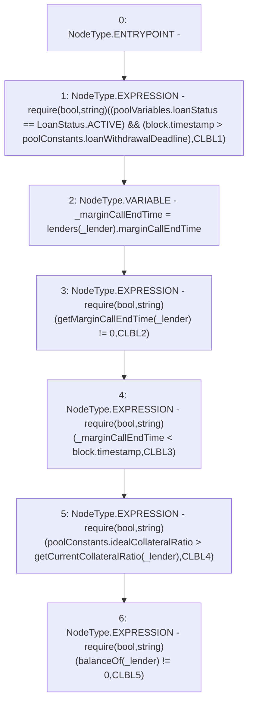

# Context: Pool._canLenderBeLiquidated

**Contract:** `Pool` (Inherits: ReentrancyGuard, IPool, ERC20PausableUpgradeable, PausableUpgradeable, ERC20Upgradeable, IERC20Upgradeable, ContextUpgradeable, Initializable)
**Signature:** `_canLenderBeLiquidated(address)`
**Method Selector ID:** `Internal (No Method ID)`
**Visibility:** `internal`
**Environment-Free:** `No (reads EVM state context)`
**Modifiers:** None

### State Variables Interaction
- **Reads:** lenders, poolConstants, poolVariables
- **Writes:** None

### Assertion Checks & Business Requirements
- require/assert: `require(bool,string)((poolVariables.loanStatus == LoanStatus.ACTIVE) && (block.timestamp > poolConstants.loanWithdrawalDeadline),CLBL1)`
- require/assert: `require(bool,string)(getMarginCallEndTime(_lender) != 0,CLBL2)`
- require/assert: `require(bool,string)(_marginCallEndTime < block.timestamp,CLBL3)`
- require/assert: `require(bool,string)(poolConstants.idealCollateralRatio > getCurrentCollateralRatio(_lender),CLBL4)`
- require/assert: `require(bool,string)(balanceOf(_lender) != 0,CLBL5)`

### Environment & Verification Flags
- **Uses Foundry Cheatcodes:** No
- **Has Echidna Properties:** No

### Internal Calls Tree
- None

### External Calls / Value Transfers
- None

### Control Flow Graph (CFG)


### Source Mapping
Declared in: `contracts/Pool/Pool.sol` on lines **801** to **809**

```solidity
    function _canLenderBeLiquidated(address _lender) internal {
        require((poolVariables.loanStatus == LoanStatus.ACTIVE) && (block.timestamp > poolConstants.loanWithdrawalDeadline), 'CLBL1');
        uint256 _marginCallEndTime = lenders[_lender].marginCallEndTime;
        require(getMarginCallEndTime(_lender) != 0, 'CLBL2');
        require(_marginCallEndTime < block.timestamp, 'CLBL3');

        require(poolConstants.idealCollateralRatio > getCurrentCollateralRatio(_lender), 'CLBL4');
        require(balanceOf(_lender) != 0, 'CLBL5');
    }

```
