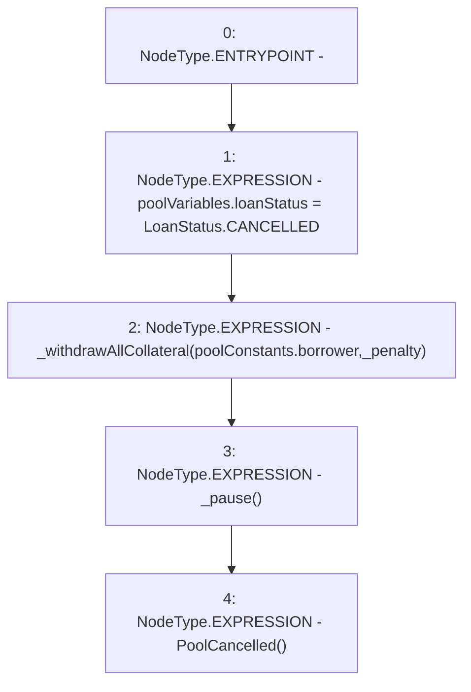

# Context: Pool._cancelPool

**Contract:** `Pool` (Inherits: ReentrancyGuard, IPool, ERC20PausableUpgradeable, PausableUpgradeable, ERC20Upgradeable, IERC20Upgradeable, ContextUpgradeable, Initializable)
**Signature:** `_cancelPool(uint256)`
**Method Selector ID:** `Internal (No Method ID)`
**Visibility:** `internal`
**Environment-Free:** `No (reads EVM state context)`
**Modifiers:** None

### State Variables Interaction
- **Reads:** poolConstants, poolVariables
- **Writes:** poolVariables

### Environment & Verification Flags
- **Uses Foundry Cheatcodes:** No
- **Has Echidna Properties:** No

### Internal Calls Tree
- None

### External Calls / Value Transfers
- None

### Control Flow Graph (CFG)


### Source Mapping
Declared in: `contracts/Pool/Pool.sol` on lines **537** to **542**

```solidity
    function _cancelPool(uint256 _penalty) internal {
        poolVariables.loanStatus = LoanStatus.CANCELLED;
        _withdrawAllCollateral(poolConstants.borrower, _penalty);
        _pause();
        emit PoolCancelled();
    }

```
