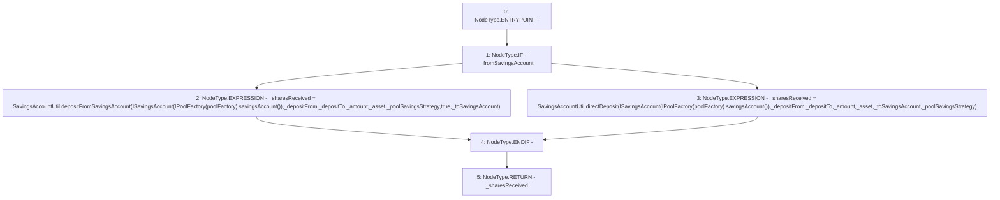

# Context: Pool._deposit

**Contract:** `Pool` (Inherits: ReentrancyGuard, IPool, ERC20PausableUpgradeable, PausableUpgradeable, ERC20Upgradeable, IERC20Upgradeable, ContextUpgradeable, Initializable)
**Signature:** `_deposit(bool,bool,address,uint256,address,address,address) returns (uint256)`
**Method Selector ID:** `Internal (No Method ID)`
**Visibility:** `internal`
**Environment-Free:** `No (reads EVM state context)`
**Modifiers:** None

### State Variables Interaction
- **Reads:** poolFactory
- **Writes:** None

### Environment & Verification Flags
- **Uses Foundry Cheatcodes:** No
- **Has Echidna Properties:** No

### Internal Calls Tree
- None

### External Calls / Value Transfers
- `IPoolFactory.TMP_1528(address) = HIGH_LEVEL_CALL, dest:TMP_1527(IPoolFactory), function:savingsAccount, arguments:[]  `
- `IPoolFactory.TMP_1532(address) = HIGH_LEVEL_CALL, dest:TMP_1531(IPoolFactory), function:savingsAccount, arguments:[]  `
- `SavingsAccountUtil.TMP_1530(uint256) = LIBRARY_CALL, dest:SavingsAccountUtil, function:SavingsAccountUtil.depositFromSavingsAccount(ISavingsAccount,address,address,uint256,address,address,bool,bool), arguments:['TMP_1529', '_depositFrom', '_depositTo', '_amount', '_asset', '_poolSavingsStrategy', 'True', '_toSavingsAccount'] `
- `SavingsAccountUtil.TMP_1534(uint256) = LIBRARY_CALL, dest:SavingsAccountUtil, function:SavingsAccountUtil.directDeposit(ISavingsAccount,address,address,uint256,address,bool,address), arguments:['TMP_1533', '_depositFrom', '_depositTo', '_amount', '_asset', '_toSavingsAccount', '_poolSavingsStrategy'] `

### Control Flow Graph (CFG)


### Source Mapping
Declared in: `contracts/Pool/Pool.sol` on lines **236** to **267**

```solidity
    function _deposit(
        bool _fromSavingsAccount,
        bool _toSavingsAccount,
        address _asset,
        uint256 _amount,
        address _poolSavingsStrategy,
        address _depositFrom,
        address _depositTo
    ) internal returns (uint256 _sharesReceived) {
        if (_fromSavingsAccount) {
            _sharesReceived = SavingsAccountUtil.depositFromSavingsAccount(
                ISavingsAccount(IPoolFactory(poolFactory).savingsAccount()),
                _depositFrom,
                _depositTo,
                _amount,
                _asset,
                _poolSavingsStrategy,
                true,
                _toSavingsAccount
            );
        } else {
            _sharesReceived = SavingsAccountUtil.directDeposit(
                ISavingsAccount(IPoolFactory(poolFactory).savingsAccount()),
                _depositFrom,
                _depositTo,
                _amount,
                _asset,
                _toSavingsAccount,
                _poolSavingsStrategy
            );
        }
    }

```
