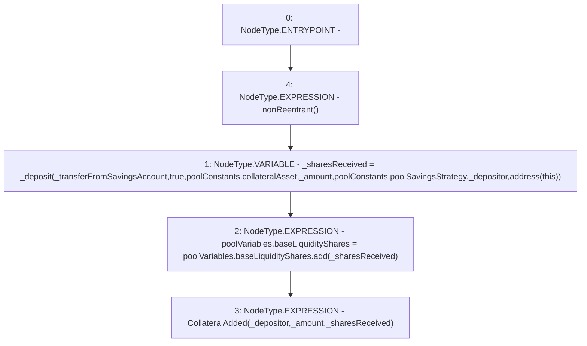

# Context: Pool._depositCollateral

**Contract:** `Pool` (Inherits: ReentrancyGuard, IPool, ERC20PausableUpgradeable, PausableUpgradeable, ERC20Upgradeable, IERC20Upgradeable, ContextUpgradeable, Initializable)
**Signature:** `_depositCollateral(address,uint256,bool)`
**Method Selector ID:** `Internal (No Method ID)`
**Visibility:** `internal`
**Environment-Free:** `No (reads EVM state context)`
**Modifiers:**
- `nonReentrant`
  ```solidity
  modifier nonReentrant() {
          // On the first call to nonReentrant, _notEntered will be true
          require(_status != _ENTERED, "ReentrancyGuard: reentrant call");
  
          // Any calls to nonReentrant after this point will fail
          _status = _ENTERED;
  
          _;
  
          // By storing the original value once again, a refund is triggered (see
          // https://eips.ethereum.org/EIPS/eip-2200)
          _status = _NOT_ENTERED;
      }
  ```

### State Variables Interaction
- **Reads:** poolConstants, poolVariables
- **Writes:** poolVariables

### Environment & Verification Flags
- **Uses Foundry Cheatcodes:** No
- **Has Echidna Properties:** No

### Internal Calls Tree
- None

### External Calls / Value Transfers
- `SafeMathUpgradeable.TMP_1524(uint256) = LIBRARY_CALL, dest:SafeMathUpgradeable, function:SafeMathUpgradeable.add(uint256,uint256), arguments:['REF_591', '_sharesReceived'] `

### Control Flow Graph (CFG)


### Source Mapping
Declared in: `contracts/Pool/Pool.sol` on lines **207** to **223**

```solidity
    function _depositCollateral(
        address _depositor,
        uint256 _amount,
        bool _transferFromSavingsAccount
    ) internal nonReentrant {
        uint256 _sharesReceived = _deposit(
            _transferFromSavingsAccount,
            true,
            poolConstants.collateralAsset,
            _amount,
            poolConstants.poolSavingsStrategy,
            _depositor,
            address(this)
        );
        poolVariables.baseLiquidityShares = poolVariables.baseLiquidityShares.add(_sharesReceived);
        emit CollateralAdded(_depositor, _amount, _sharesReceived);
    }

```
