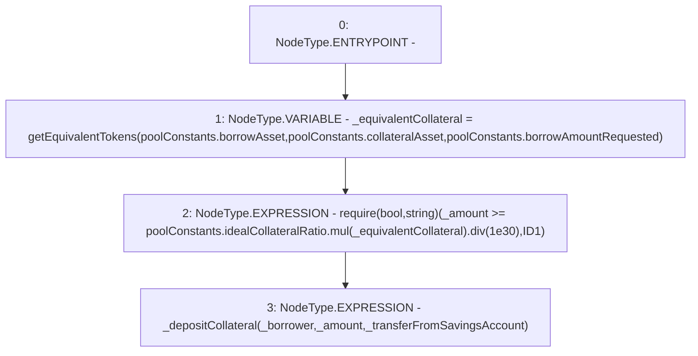

# Context: Pool._initialDeposit

**Contract:** `Pool` (Inherits: ReentrancyGuard, IPool, ERC20PausableUpgradeable, PausableUpgradeable, ERC20Upgradeable, IERC20Upgradeable, ContextUpgradeable, Initializable)
**Signature:** `_initialDeposit(address,uint256,bool)`
**Method Selector ID:** `Internal (No Method ID)`
**Visibility:** `internal`
**Environment-Free:** `No (reads EVM state context)`
**Modifiers:** None

### State Variables Interaction
- **Reads:** poolConstants
- **Writes:** None

### Assertion Checks & Business Requirements
- require/assert: `require(bool,string)(_amount >= poolConstants.idealCollateralRatio.mul(_equivalentCollateral).div(1e30),ID1)`

### Environment & Verification Flags
- **Uses Foundry Cheatcodes:** No
- **Has Echidna Properties:** No

### Internal Calls Tree
- None

### External Calls / Value Transfers
- `SafeMathUpgradeable.TMP_1517(uint256) = LIBRARY_CALL, dest:SafeMathUpgradeable, function:SafeMathUpgradeable.mul(uint256,uint256), arguments:['REF_585', '_equivalentCollateral'] `
- `SafeMathUpgradeable.TMP_1518(uint256) = LIBRARY_CALL, dest:SafeMathUpgradeable, function:SafeMathUpgradeable.div(uint256,uint256), arguments:['TMP_1517', '1000000000000000000000000000000'] `

### Control Flow Graph (CFG)


### Source Mapping
Declared in: `contracts/Pool/Pool.sol` on lines **187** to **199**

```solidity
    function _initialDeposit(
        address _borrower,
        uint256 _amount,
        bool _transferFromSavingsAccount
    ) internal {
        uint256 _equivalentCollateral = getEquivalentTokens(
            poolConstants.borrowAsset,
            poolConstants.collateralAsset,
            poolConstants.borrowAmountRequested
        );
        require(_amount >= poolConstants.idealCollateralRatio.mul(_equivalentCollateral).div(1e30), 'ID1');
        _depositCollateral(_borrower, _amount, _transferFromSavingsAccount);
    }

```
