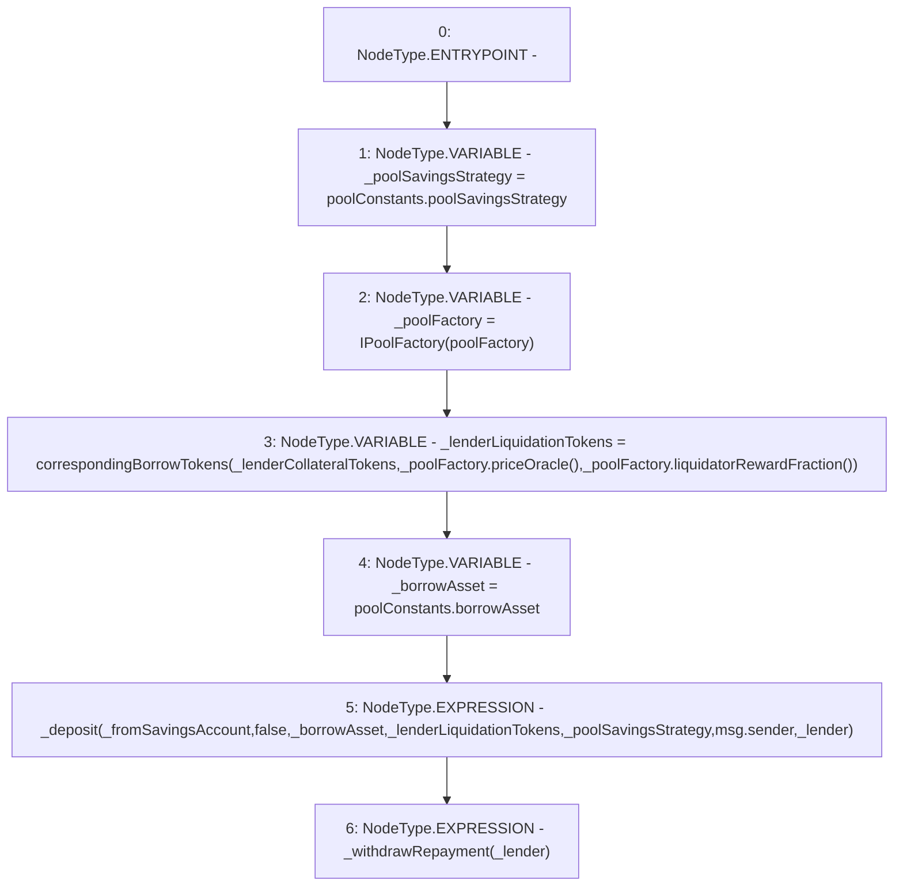

# Context: Pool._liquidateForLender

**Contract:** `Pool` (Inherits: ReentrancyGuard, IPool, ERC20PausableUpgradeable, PausableUpgradeable, ERC20Upgradeable, IERC20Upgradeable, ContextUpgradeable, Initializable)
**Signature:** `_liquidateForLender(bool,address,uint256)`
**Method Selector ID:** `Internal (No Method ID)`
**Visibility:** `internal`
**Environment-Free:** `No (reads EVM state context)`
**Modifiers:** None

### State Variables Interaction
- **Reads:** poolConstants, poolFactory
- **Writes:** None

### Environment & Verification Flags
- **Uses Foundry Cheatcodes:** No
- **Has Echidna Properties:** No

### Internal Calls Tree
- None

### External Calls / Value Transfers
- `IPoolFactory.TMP_1873(uint256) = HIGH_LEVEL_CALL, dest:_poolFactory(IPoolFactory), function:liquidatorRewardFraction, arguments:[]  `
- `IPoolFactory.TMP_1872(address) = HIGH_LEVEL_CALL, dest:_poolFactory(IPoolFactory), function:priceOracle, arguments:[]  `

### Control Flow Graph (CFG)


### Source Mapping
Declared in: `contracts/Pool/Pool.sol` on lines **838** to **855**

```solidity
    function _liquidateForLender(
        bool _fromSavingsAccount,
        address _lender,
        uint256 _lenderCollateralTokens
    ) internal {
        address _poolSavingsStrategy = poolConstants.poolSavingsStrategy;

        IPoolFactory _poolFactory = IPoolFactory(poolFactory);
        uint256 _lenderLiquidationTokens = correspondingBorrowTokens(
            _lenderCollateralTokens,
            _poolFactory.priceOracle(),
            _poolFactory.liquidatorRewardFraction()
        );

        address _borrowAsset = poolConstants.borrowAsset;
        _deposit(_fromSavingsAccount, false, _borrowAsset, _lenderLiquidationTokens, _poolSavingsStrategy, msg.sender, _lender);
        _withdrawRepayment(_lender);
    }

```
