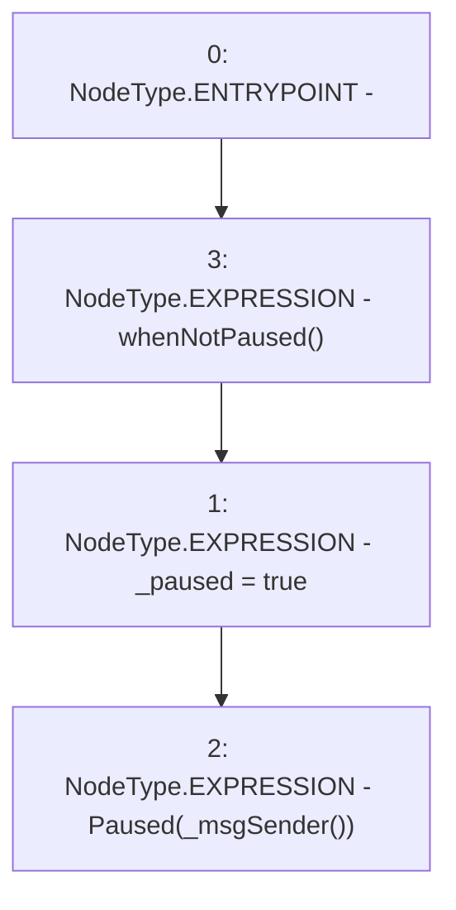

# Context: Pool._pause

**Contract:** `Pool` (Inherits: ReentrancyGuard, IPool, ERC20PausableUpgradeable, PausableUpgradeable, ERC20Upgradeable, IERC20Upgradeable, ContextUpgradeable, Initializable)
**Signature:** `_pause()`
**Method Selector ID:** `Internal (No Method ID)`
**Visibility:** `internal`
**Environment-Free:** `No (reads EVM state context)`
**Modifiers:**
- `whenNotPaused`
  ```solidity
  modifier whenNotPaused() {
          require(!paused(), "Pausable: paused");
          _;
      }
  ```

### State Variables Interaction
- **Reads:** None
- **Writes:** _paused

### Environment & Verification Flags
- **Uses Foundry Cheatcodes:** No
- **Has Echidna Properties:** No

### Internal Calls Tree
- None

### External Calls / Value Transfers
- None

### Control Flow Graph (CFG)


### Source Mapping
Declared in: `node_modules/@openzeppelin/contracts-upgradeable/utils/PausableUpgradeable.sol` on lines **80** to **83**

```solidity
    function _pause() internal virtual whenNotPaused {
        _paused = true;
        emit Paused(_msgSender());
    }

```
