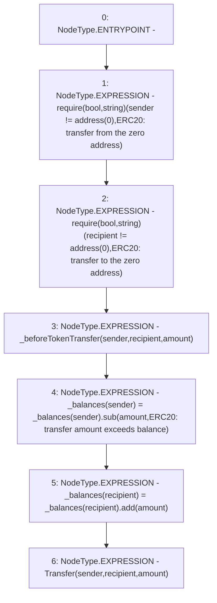

# Context: Pool._transfer

**Contract:** `Pool` (Inherits: ReentrancyGuard, IPool, ERC20PausableUpgradeable, PausableUpgradeable, ERC20Upgradeable, IERC20Upgradeable, ContextUpgradeable, Initializable)
**Signature:** `_transfer(address,address,uint256)`
**Method Selector ID:** `Internal (No Method ID)`
**Visibility:** `internal`
**Environment-Free:** `No (reads EVM state context)`
**Modifiers:** None

### State Variables Interaction
- **Reads:** _balances
- **Writes:** _balances

### Assertion Checks & Business Requirements
- require/assert: `require(bool,string)(sender != address(0),ERC20: transfer from the zero address)`
- require/assert: `require(bool,string)(recipient != address(0),ERC20: transfer to the zero address)`

### Environment & Verification Flags
- **Uses Foundry Cheatcodes:** No
- **Has Echidna Properties:** No

### Internal Calls Tree
- None

### External Calls / Value Transfers
- `SafeMathUpgradeable.TMP_1474(uint256) = LIBRARY_CALL, dest:SafeMathUpgradeable, function:SafeMathUpgradeable.add(uint256,uint256), arguments:['REF_554', 'amount'] `
- `TMP_1468(None) = SOLIDITY_CALL require(bool,string)(TMP_1467,ERC20: transfer from the zero address)`
- `SafeMathUpgradeable.TMP_1473(uint256) = LIBRARY_CALL, dest:SafeMathUpgradeable, function:SafeMathUpgradeable.sub(uint256,uint256,string), arguments:['REF_551', 'amount', 'ERC20: transfer amount exceeds balance'] `
- `TMP_1471(None) = SOLIDITY_CALL require(bool,string)(TMP_1470,ERC20: transfer to the zero address)`

### Control Flow Graph (CFG)


### Source Mapping
Declared in: `node_modules/@openzeppelin/contracts-upgradeable/token/ERC20/ERC20Upgradeable.sol` on lines **214** to **223**

```solidity
    function _transfer(address sender, address recipient, uint256 amount) internal virtual {
        require(sender != address(0), "ERC20: transfer from the zero address");
        require(recipient != address(0), "ERC20: transfer to the zero address");

        _beforeTokenTransfer(sender, recipient, amount);

        _balances[sender] = _balances[sender].sub(amount, "ERC20: transfer amount exceeds balance");
        _balances[recipient] = _balances[recipient].add(amount);
        emit Transfer(sender, recipient, amount);
    }

```
