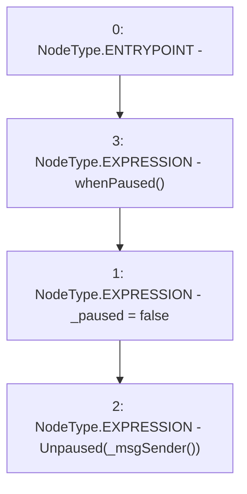

# Context: Pool._unpause

**Contract:** `Pool` (Inherits: ReentrancyGuard, IPool, ERC20PausableUpgradeable, PausableUpgradeable, ERC20Upgradeable, IERC20Upgradeable, ContextUpgradeable, Initializable)
**Signature:** `_unpause()`
**Method Selector ID:** `Internal (No Method ID)`
**Visibility:** `internal`
**Environment-Free:** `No (reads EVM state context)`
**Modifiers:**
- `whenPaused`
  ```solidity
  modifier whenPaused() {
          require(paused(), "Pausable: not paused");
          _;
      }
  ```

### State Variables Interaction
- **Reads:** None
- **Writes:** _paused

### Environment & Verification Flags
- **Uses Foundry Cheatcodes:** No
- **Has Echidna Properties:** No

### Internal Calls Tree
- None

### External Calls / Value Transfers
- None

### Control Flow Graph (CFG)


### Source Mapping
Declared in: `node_modules/@openzeppelin/contracts-upgradeable/utils/PausableUpgradeable.sol` on lines **92** to **95**

```solidity
    function _unpause() internal virtual whenPaused {
        _paused = false;
        emit Unpaused(_msgSender());
    }

```
