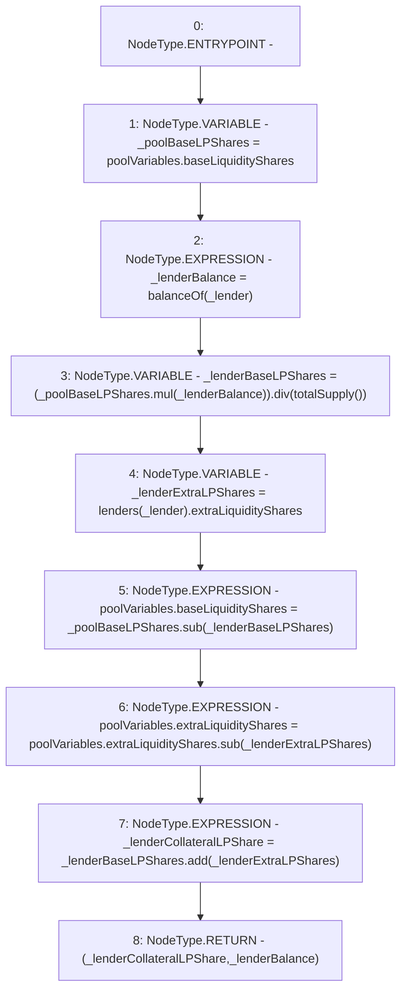

# Context: Pool._updateLenderSharesDuringLiquidation

**Contract:** `Pool` (Inherits: ReentrancyGuard, IPool, ERC20PausableUpgradeable, PausableUpgradeable, ERC20Upgradeable, IERC20Upgradeable, ContextUpgradeable, Initializable)
**Signature:** `_updateLenderSharesDuringLiquidation(address) returns (uint256, uint256)`
**Method Selector ID:** `Internal (No Method ID)`
**Visibility:** `internal`
**Environment-Free:** `Yes`
**Modifiers:** None

### State Variables Interaction
- **Reads:** lenders, poolVariables
- **Writes:** poolVariables

### Environment & Verification Flags
- **Uses Foundry Cheatcodes:** No
- **Has Echidna Properties:** No

### Internal Calls Tree
- None

### External Calls / Value Transfers
- `SafeMathUpgradeable.TMP_1868(uint256) = LIBRARY_CALL, dest:SafeMathUpgradeable, function:SafeMathUpgradeable.sub(uint256,uint256), arguments:['_poolBaseLPShares', '_lenderBaseLPShares'] `
- `SafeMathUpgradeable.TMP_1867(uint256) = LIBRARY_CALL, dest:SafeMathUpgradeable, function:SafeMathUpgradeable.div(uint256,uint256), arguments:['TMP_1865', 'TMP_1866'] `
- `SafeMathUpgradeable.TMP_1870(uint256) = LIBRARY_CALL, dest:SafeMathUpgradeable, function:SafeMathUpgradeable.add(uint256,uint256), arguments:['_lenderBaseLPShares', '_lenderExtraLPShares'] `
- `SafeMathUpgradeable.TMP_1865(uint256) = LIBRARY_CALL, dest:SafeMathUpgradeable, function:SafeMathUpgradeable.mul(uint256,uint256), arguments:['_poolBaseLPShares', '_lenderBalance'] `
- `SafeMathUpgradeable.TMP_1869(uint256) = LIBRARY_CALL, dest:SafeMathUpgradeable, function:SafeMathUpgradeable.sub(uint256,uint256), arguments:['REF_834', '_lenderExtraLPShares'] `

### Control Flow Graph (CFG)


### Source Mapping
Declared in: `contracts/Pool/Pool.sol` on lines **817** to **830**

```solidity
    function _updateLenderSharesDuringLiquidation(address _lender)
        internal
        returns (uint256 _lenderCollateralLPShare, uint256 _lenderBalance)
    {
        uint256 _poolBaseLPShares = poolVariables.baseLiquidityShares;
        _lenderBalance = balanceOf(_lender);

        uint256 _lenderBaseLPShares = (_poolBaseLPShares.mul(_lenderBalance)).div(totalSupply());
        uint256 _lenderExtraLPShares = lenders[_lender].extraLiquidityShares;
        poolVariables.baseLiquidityShares = _poolBaseLPShares.sub(_lenderBaseLPShares);
        poolVariables.extraLiquidityShares = poolVariables.extraLiquidityShares.sub(_lenderExtraLPShares);

        _lenderCollateralLPShare = _lenderBaseLPShares.add(_lenderExtraLPShares);
    }

```
