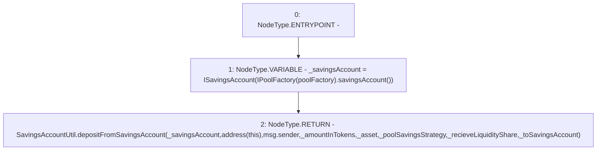

# Context: Pool._withdraw

**Contract:** `Pool` (Inherits: ReentrancyGuard, IPool, ERC20PausableUpgradeable, PausableUpgradeable, ERC20Upgradeable, IERC20Upgradeable, ContextUpgradeable, Initializable)
**Signature:** `_withdraw(bool,bool,address,address,uint256) returns (uint256)`
**Method Selector ID:** `Internal (No Method ID)`
**Visibility:** `internal`
**Environment-Free:** `No (reads EVM state context)`
**Modifiers:** None

### State Variables Interaction
- **Reads:** poolFactory
- **Writes:** None

### Environment & Verification Flags
- **Uses Foundry Cheatcodes:** No
- **Has Echidna Properties:** No

### Internal Calls Tree
- None

### External Calls / Value Transfers
- `IPoolFactory.TMP_1845(address) = HIGH_LEVEL_CALL, dest:TMP_1844(IPoolFactory), function:savingsAccount, arguments:[]  `
- `SavingsAccountUtil.TMP_1848(uint256) = LIBRARY_CALL, dest:SavingsAccountUtil, function:SavingsAccountUtil.depositFromSavingsAccount(ISavingsAccount,address,address,uint256,address,address,bool,bool), arguments:['_savingsAccount', 'TMP_1847', 'msg.sender', '_amountInTokens', '_asset', '_poolSavingsStrategy', '_recieveLiquidityShare', '_toSavingsAccount'] `

### Control Flow Graph (CFG)


### Source Mapping
Declared in: `contracts/Pool/Pool.sol` on lines **776** to **795**

```solidity
    function _withdraw(
        bool _toSavingsAccount,
        bool _recieveLiquidityShare,
        address _asset,
        address _poolSavingsStrategy,
        uint256 _amountInTokens
    ) internal returns (uint256) {
        ISavingsAccount _savingsAccount = ISavingsAccount(IPoolFactory(poolFactory).savingsAccount());
        return
            SavingsAccountUtil.depositFromSavingsAccount(
                _savingsAccount,
                address(this),
                msg.sender,
                _amountInTokens,
                _asset,
                _poolSavingsStrategy,
                _recieveLiquidityShare,
                _toSavingsAccount
            );
    }

```
