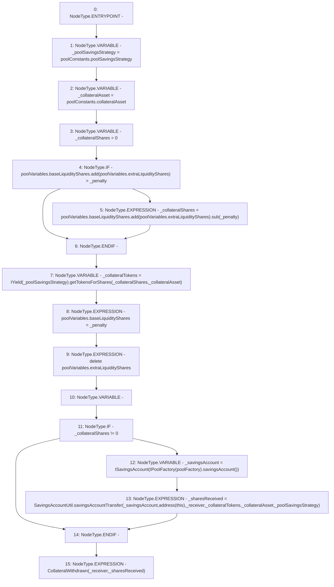

# Context: Pool._withdrawAllCollateral

**Contract:** `Pool` (Inherits: ReentrancyGuard, IPool, ERC20PausableUpgradeable, PausableUpgradeable, ERC20Upgradeable, IERC20Upgradeable, ContextUpgradeable, Initializable)
**Signature:** `_withdrawAllCollateral(address,uint256)`
**Method Selector ID:** `Internal (No Method ID)`
**Visibility:** `internal`
**Environment-Free:** `Yes`
**Modifiers:** None

### State Variables Interaction
- **Reads:** poolConstants, poolFactory, poolVariables
- **Writes:** poolVariables

### Environment & Verification Flags
- **Uses Foundry Cheatcodes:** No
- **Has Echidna Properties:** No

### Internal Calls Tree
- None

### External Calls / Value Transfers
- `SafeMathUpgradeable.TMP_1587(uint256) = LIBRARY_CALL, dest:SafeMathUpgradeable, function:SafeMathUpgradeable.add(uint256,uint256), arguments:['REF_642', 'REF_644'] `
- `SafeMathUpgradeable.TMP_1590(uint256) = LIBRARY_CALL, dest:SafeMathUpgradeable, function:SafeMathUpgradeable.sub(uint256,uint256), arguments:['TMP_1589', '_penalty'] `
- `IYield.TMP_1592(uint256) = HIGH_LEVEL_CALL, dest:TMP_1591(IYield), function:getTokensForShares, arguments:['_collateralShares', '_collateralAsset']  `
- `SavingsAccountUtil.TMP_1598(uint256) = LIBRARY_CALL, dest:SavingsAccountUtil, function:SavingsAccountUtil.savingsAccountTransfer(ISavingsAccount,address,address,uint256,address,address), arguments:['_savingsAccount', 'TMP_1597', '_receiver', '_collateralTokens', '_collateralAsset', '_poolSavingsStrategy'] `
- `IPoolFactory.TMP_1595(address) = HIGH_LEVEL_CALL, dest:TMP_1594(IPoolFactory), function:savingsAccount, arguments:[]  `
- `SafeMathUpgradeable.TMP_1589(uint256) = LIBRARY_CALL, dest:SafeMathUpgradeable, function:SafeMathUpgradeable.add(uint256,uint256), arguments:['REF_645', 'REF_647'] `

### Control Flow Graph (CFG)


### Source Mapping
Declared in: `contracts/Pool/Pool.sol` on lines **355** to **381**

```solidity
    function _withdrawAllCollateral(address _receiver, uint256 _penalty) internal {
        address _poolSavingsStrategy = poolConstants.poolSavingsStrategy;
        address _collateralAsset = poolConstants.collateralAsset;
        uint256 _collateralShares = 0;
        if (poolVariables.baseLiquidityShares.add(poolVariables.extraLiquidityShares) > _penalty) {
            _collateralShares = poolVariables.baseLiquidityShares.add(poolVariables.extraLiquidityShares).sub(_penalty);
        }
        // uint256 _collateralTokens = _collateralShares;
        uint256 _collateralTokens = IYield(_poolSavingsStrategy).getTokensForShares(_collateralShares, _collateralAsset);

        poolVariables.baseLiquidityShares = _penalty;
        delete poolVariables.extraLiquidityShares;

        uint256 _sharesReceived;
        if (_collateralShares != 0) {
            ISavingsAccount _savingsAccount = ISavingsAccount(IPoolFactory(poolFactory).savingsAccount());
            _sharesReceived = SavingsAccountUtil.savingsAccountTransfer(
                _savingsAccount,
                address(this),
                _receiver,
                _collateralTokens,
                _collateralAsset,
                _poolSavingsStrategy
            );
        }
        emit CollateralWithdrawn(_receiver, _sharesReceived);
    }

```
