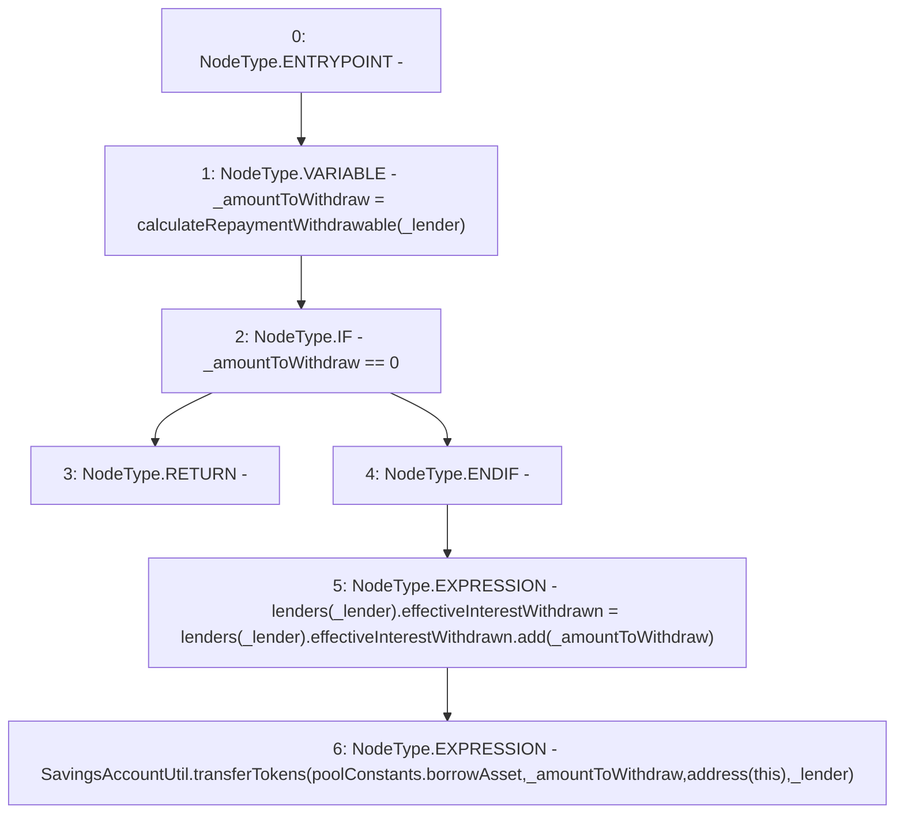

# Context: Pool._withdrawRepayment

**Contract:** `Pool` (Inherits: ReentrancyGuard, IPool, ERC20PausableUpgradeable, PausableUpgradeable, ERC20Upgradeable, IERC20Upgradeable, ContextUpgradeable, Initializable)
**Signature:** `_withdrawRepayment(address)`
**Method Selector ID:** `Internal (No Method ID)`
**Visibility:** `internal`
**Environment-Free:** `Yes`
**Modifiers:** None

### State Variables Interaction
- **Reads:** lenders, poolConstants
- **Writes:** lenders

### Environment & Verification Flags
- **Uses Foundry Cheatcodes:** No
- **Has Echidna Properties:** No

### Internal Calls Tree
- None

### External Calls / Value Transfers
- `SavingsAccountUtil.TMP_1918(uint256) = LIBRARY_CALL, dest:SavingsAccountUtil, function:SavingsAccountUtil.transferTokens(address,uint256,address,address), arguments:['REF_876', '_amountToWithdraw', 'TMP_1917', '_lender'] `
- `SafeMathUpgradeable.TMP_1916(uint256) = LIBRARY_CALL, dest:SafeMathUpgradeable, function:SafeMathUpgradeable.add(uint256,uint256), arguments:['REF_873', '_amountToWithdraw'] `

### Control Flow Graph (CFG)


### Source Mapping
Declared in: `contracts/Pool/Pool.sol` on lines **965** to **974**

```solidity
    function _withdrawRepayment(address _lender) internal {
        uint256 _amountToWithdraw = calculateRepaymentWithdrawable(_lender);

        if (_amountToWithdraw == 0) {
            return;
        }
        lenders[_lender].effectiveInterestWithdrawn = lenders[_lender].effectiveInterestWithdrawn.add(_amountToWithdraw);

        SavingsAccountUtil.transferTokens(poolConstants.borrowAsset, _amountToWithdraw, address(this), _lender);
    }

```
