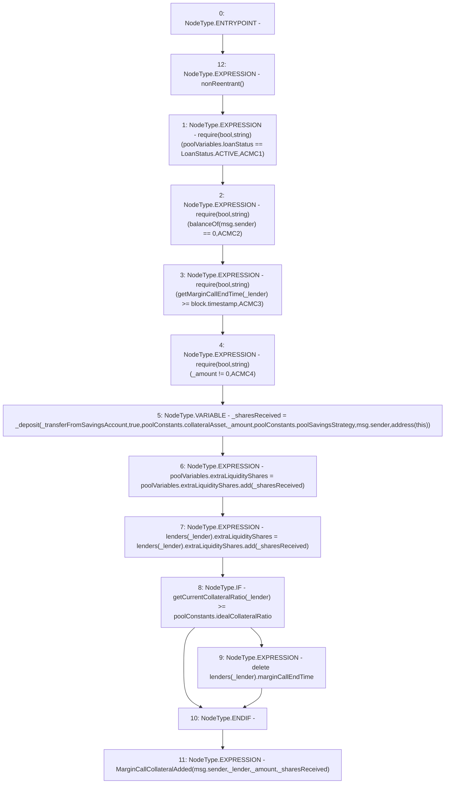

# Context: Pool.addCollateralInMarginCall

**Contract:** `Pool` (Inherits: ReentrancyGuard, IPool, ERC20PausableUpgradeable, PausableUpgradeable, ERC20Upgradeable, IERC20Upgradeable, ContextUpgradeable, Initializable)
**Signature:** `addCollateralInMarginCall(address,uint256,bool)`
**Method Selector ID:** `0xc145fe69`
**Visibility:** `external`
**Environment-Free:** `No (reads EVM state context)`
**Modifiers:**
- `nonReentrant`
  ```solidity
  modifier nonReentrant() {
          // On the first call to nonReentrant, _notEntered will be true
          require(_status != _ENTERED, "ReentrancyGuard: reentrant call");
  
          // Any calls to nonReentrant after this point will fail
          _status = _ENTERED;
  
          _;
  
          // By storing the original value once again, a refund is triggered (see
          // https://eips.ethereum.org/EIPS/eip-2200)
          _status = _NOT_ENTERED;
      }
  ```

### State Variables Interaction
- **Reads:** lenders, poolConstants, poolVariables
- **Writes:** lenders, poolVariables

### Assertion Checks & Business Requirements
- require/assert: `require(bool,string)(poolVariables.loanStatus == LoanStatus.ACTIVE,ACMC1)`
- require/assert: `require(bool,string)(balanceOf(msg.sender) == 0,ACMC2)`
- require/assert: `require(bool,string)(getMarginCallEndTime(_lender) >= block.timestamp,ACMC3)`
- require/assert: `require(bool,string)(_amount != 0,ACMC4)`

### Environment & Verification Flags
- **Uses Foundry Cheatcodes:** No
- **Has Echidna Properties:** No

### Internal Calls Tree
- None

### External Calls / Value Transfers
- `SafeMathUpgradeable.TMP_1547(uint256) = LIBRARY_CALL, dest:SafeMathUpgradeable, function:SafeMathUpgradeable.add(uint256,uint256), arguments:['REF_602', '_sharesReceived'] `
- `SafeMathUpgradeable.TMP_1548(uint256) = LIBRARY_CALL, dest:SafeMathUpgradeable, function:SafeMathUpgradeable.add(uint256,uint256), arguments:['REF_607', '_sharesReceived'] `

### Control Flow Graph (CFG)


### Source Mapping
Declared in: `contracts/Pool/Pool.sol` on lines **275** to **305**

```solidity
    function addCollateralInMarginCall(
        address _lender,
        uint256 _amount,
        bool _transferFromSavingsAccount
    ) external payable override nonReentrant {
        require(poolVariables.loanStatus == LoanStatus.ACTIVE, 'ACMC1');
        require(balanceOf(msg.sender) == 0, 'ACMC2');
        require(getMarginCallEndTime(_lender) >= block.timestamp, 'ACMC3');

        require(_amount != 0, 'ACMC4');

        uint256 _sharesReceived = _deposit(
            _transferFromSavingsAccount,
            true,
            poolConstants.collateralAsset,
            _amount,
            poolConstants.poolSavingsStrategy,
            msg.sender,
            address(this)
        );

        poolVariables.extraLiquidityShares = poolVariables.extraLiquidityShares.add(_sharesReceived);

        lenders[_lender].extraLiquidityShares = lenders[_lender].extraLiquidityShares.add(_sharesReceived);

        if (getCurrentCollateralRatio(_lender) >= poolConstants.idealCollateralRatio) {
            delete lenders[_lender].marginCallEndTime;
        }

        emit MarginCallCollateralAdded(msg.sender, _lender, _amount, _sharesReceived);
    }

```
