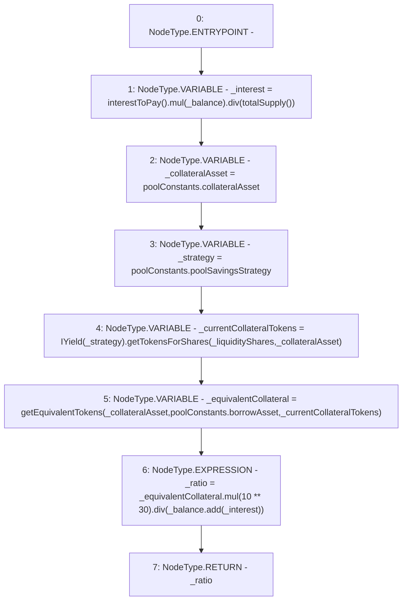

# Context: Pool.calculateCollateralRatio

**Contract:** `Pool` (Inherits: ReentrancyGuard, IPool, ERC20PausableUpgradeable, PausableUpgradeable, ERC20Upgradeable, IERC20Upgradeable, ContextUpgradeable, Initializable)
**Signature:** `calculateCollateralRatio(uint256,uint256) returns (uint256)`
**Method Selector ID:** `0x46b55fbb`
**Visibility:** `public`
**Environment-Free:** `No (reads EVM state context)`
**Modifiers:** None

### State Variables Interaction
- **Reads:** poolConstants
- **Writes:** None

### Environment & Verification Flags
- **Uses Foundry Cheatcodes:** No
- **Has Echidna Properties:** No

### Internal Calls Tree
- None

### External Calls / Value Transfers
- `SafeMathUpgradeable.TMP_1807(uint256) = LIBRARY_CALL, dest:SafeMathUpgradeable, function:SafeMathUpgradeable.div(uint256,uint256), arguments:['TMP_1805', 'TMP_1806'] `
- `SafeMathUpgradeable.TMP_1813(uint256) = LIBRARY_CALL, dest:SafeMathUpgradeable, function:SafeMathUpgradeable.add(uint256,uint256), arguments:['_balance', '_interest'] `
- `SafeMathUpgradeable.TMP_1805(uint256) = LIBRARY_CALL, dest:SafeMathUpgradeable, function:SafeMathUpgradeable.mul(uint256,uint256), arguments:['TMP_1804', '_balance'] `
- `IYield.TMP_1809(uint256) = HIGH_LEVEL_CALL, dest:TMP_1808(IYield), function:getTokensForShares, arguments:['_liquidityShares', '_collateralAsset']  `
- `SafeMathUpgradeable.TMP_1812(uint256) = LIBRARY_CALL, dest:SafeMathUpgradeable, function:SafeMathUpgradeable.mul(uint256,uint256), arguments:['_equivalentCollateral', 'TMP_1811'] `
- `SafeMathUpgradeable.TMP_1814(uint256) = LIBRARY_CALL, dest:SafeMathUpgradeable, function:SafeMathUpgradeable.div(uint256,uint256), arguments:['TMP_1812', 'TMP_1813'] `

### Control Flow Graph (CFG)


### Source Mapping
Declared in: `contracts/Pool/Pool.sol` on lines **694** to **702**

```solidity
    function calculateCollateralRatio(uint256 _balance, uint256 _liquidityShares) public returns (uint256 _ratio) {
        uint256 _interest = interestToPay().mul(_balance).div(totalSupply());
        address _collateralAsset = poolConstants.collateralAsset;
        address _strategy = poolConstants.poolSavingsStrategy;
        uint256 _currentCollateralTokens = IYield(_strategy).getTokensForShares(_liquidityShares, _collateralAsset);

        uint256 _equivalentCollateral = getEquivalentTokens(_collateralAsset, poolConstants.borrowAsset, _currentCollateralTokens);
        _ratio = _equivalentCollateral.mul(10**30).div(_balance.add(_interest));
    }

```
