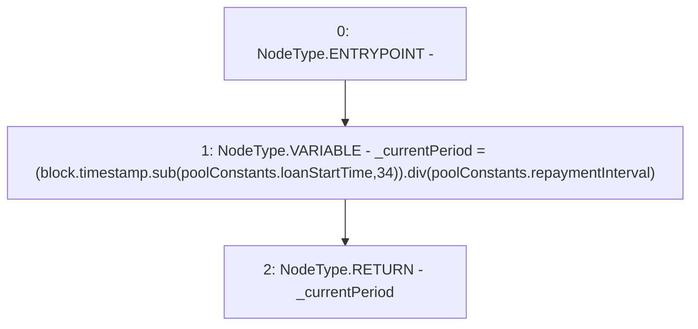

# Context: Pool.calculateCurrentPeriod

**Contract:** `Pool` (Inherits: ReentrancyGuard, IPool, ERC20PausableUpgradeable, PausableUpgradeable, ERC20Upgradeable, IERC20Upgradeable, ContextUpgradeable, Initializable)
**Signature:** `calculateCurrentPeriod() returns (uint256)`
**Method Selector ID:** `0x0fc72889`
**Visibility:** `external`
**Environment-Free:** `No (reads EVM state context)`
**Modifiers:** None

### State Variables Interaction
- **Reads:** poolConstants
- **Writes:** None

### Environment & Verification Flags
- **Uses Foundry Cheatcodes:** No
- **Has Echidna Properties:** No

### Internal Calls Tree
- None

### External Calls / Value Transfers
- `SafeMathUpgradeable.TMP_1899(uint256) = LIBRARY_CALL, dest:SafeMathUpgradeable, function:SafeMathUpgradeable.sub(uint256,uint256,string), arguments:['block.timestamp', 'REF_860', '34'] `
- `SafeMathUpgradeable.TMP_1900(uint256) = LIBRARY_CALL, dest:SafeMathUpgradeable, function:SafeMathUpgradeable.div(uint256,uint256), arguments:['TMP_1899', 'REF_862'] `

### Control Flow Graph (CFG)


### Source Mapping
Declared in: `contracts/Pool/Pool.sol` on lines **934** to **937**

```solidity
    function calculateCurrentPeriod() external view returns (uint256) {
        uint256 _currentPeriod = (block.timestamp.sub(poolConstants.loanStartTime, '34')).div(poolConstants.repaymentInterval);
        return _currentPeriod;
    }

```
