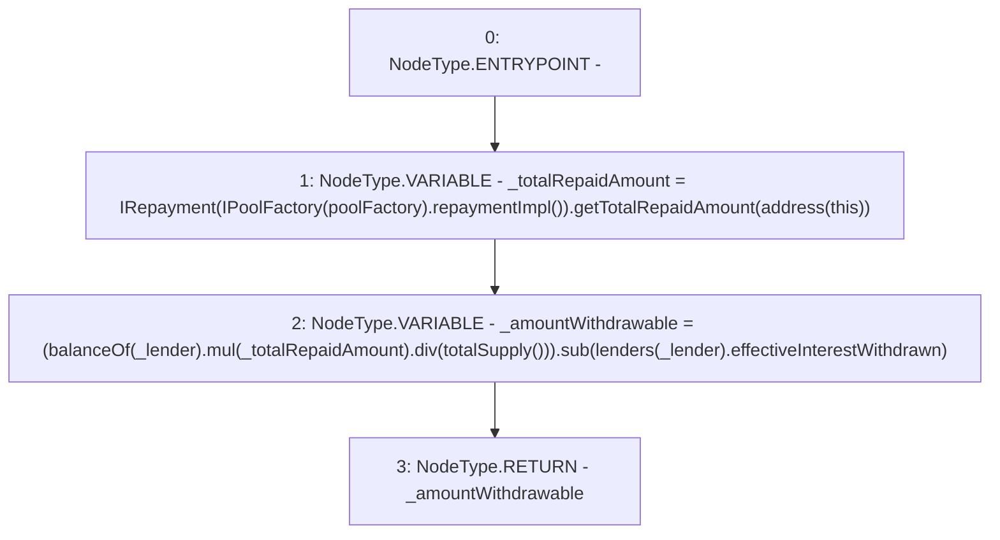

# Context: Pool.calculateRepaymentWithdrawable

**Contract:** `Pool` (Inherits: ReentrancyGuard, IPool, ERC20PausableUpgradeable, PausableUpgradeable, ERC20Upgradeable, IERC20Upgradeable, ContextUpgradeable, Initializable)
**Signature:** `calculateRepaymentWithdrawable(address) returns (uint256)`
**Method Selector ID:** `0xc4a3702f`
**Visibility:** `public`
**Environment-Free:** `Yes`
**Modifiers:** None

### State Variables Interaction
- **Reads:** lenders, poolFactory
- **Writes:** None

### Environment & Verification Flags
- **Uses Foundry Cheatcodes:** No
- **Has Echidna Properties:** No

### Internal Calls Tree
- None

### External Calls / Value Transfers
- `IRepayment.TMP_1905(uint256) = HIGH_LEVEL_CALL, dest:TMP_1903(IRepayment), function:getTotalRepaidAmount, arguments:['TMP_1904']  `
- `SafeMathUpgradeable.TMP_1909(uint256) = LIBRARY_CALL, dest:SafeMathUpgradeable, function:SafeMathUpgradeable.div(uint256,uint256), arguments:['TMP_1907', 'TMP_1908'] `
- `IPoolFactory.TMP_1902(address) = HIGH_LEVEL_CALL, dest:TMP_1901(IPoolFactory), function:repaymentImpl, arguments:[]  `
- `SafeMathUpgradeable.TMP_1907(uint256) = LIBRARY_CALL, dest:SafeMathUpgradeable, function:SafeMathUpgradeable.mul(uint256,uint256), arguments:['TMP_1906', '_totalRepaidAmount'] `
- `SafeMathUpgradeable.TMP_1910(uint256) = LIBRARY_CALL, dest:SafeMathUpgradeable, function:SafeMathUpgradeable.sub(uint256,uint256), arguments:['TMP_1909', 'REF_869'] `

### Control Flow Graph (CFG)


### Source Mapping
Declared in: `contracts/Pool/Pool.sol` on lines **944** to **952**

```solidity
    function calculateRepaymentWithdrawable(address _lender) public view returns (uint256) {
        uint256 _totalRepaidAmount = IRepayment(IPoolFactory(poolFactory).repaymentImpl()).getTotalRepaidAmount(address(this));

        uint256 _amountWithdrawable = (balanceOf(_lender).mul(_totalRepaidAmount).div(totalSupply())).sub(
            lenders[_lender].effectiveInterestWithdrawn
        );

        return _amountWithdrawable;
    }

```
