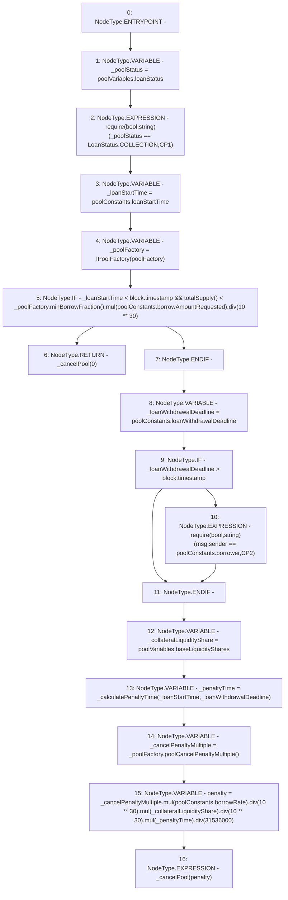

# Context: Pool.cancelPool

**Contract:** `Pool` (Inherits: ReentrancyGuard, IPool, ERC20PausableUpgradeable, PausableUpgradeable, ERC20Upgradeable, IERC20Upgradeable, ContextUpgradeable, Initializable)
**Signature:** `cancelPool()`
**Method Selector ID:** `0x1b55b2a8`
**Visibility:** `external`
**Environment-Free:** `No (reads EVM state context)`
**Modifiers:** None

### State Variables Interaction
- **Reads:** poolConstants, poolFactory, poolVariables
- **Writes:** None

### Assertion Checks & Business Requirements
- require/assert: `require(bool,string)(_poolStatus == LoanStatus.COLLECTION,CP1)`
- require/assert: `require(bool,string)(msg.sender == poolConstants.borrower,CP2)`

### Environment & Verification Flags
- **Uses Foundry Cheatcodes:** No
- **Has Echidna Properties:** No

### Internal Calls Tree
- None

### External Calls / Value Transfers
- `SafeMathUpgradeable.TMP_1704(uint256) = LIBRARY_CALL, dest:SafeMathUpgradeable, function:SafeMathUpgradeable.div(uint256,uint256), arguments:['TMP_1703', '31536000'] `
- `IPoolFactory.TMP_1696(uint256) = HIGH_LEVEL_CALL, dest:_poolFactory(IPoolFactory), function:poolCancelPenaltyMultiple, arguments:[]  `
- `IPoolFactory.TMP_1685(uint256) = HIGH_LEVEL_CALL, dest:_poolFactory(IPoolFactory), function:minBorrowFraction, arguments:[]  `
- `SafeMathUpgradeable.TMP_1688(uint256) = LIBRARY_CALL, dest:SafeMathUpgradeable, function:SafeMathUpgradeable.div(uint256,uint256), arguments:['TMP_1686', 'TMP_1687'] `
- `SafeMathUpgradeable.TMP_1697(uint256) = LIBRARY_CALL, dest:SafeMathUpgradeable, function:SafeMathUpgradeable.mul(uint256,uint256), arguments:['_cancelPenaltyMultiple', 'REF_712'] `
- `SafeMathUpgradeable.TMP_1686(uint256) = LIBRARY_CALL, dest:SafeMathUpgradeable, function:SafeMathUpgradeable.mul(uint256,uint256), arguments:['TMP_1685', 'REF_705'] `
- `SafeMathUpgradeable.TMP_1699(uint256) = LIBRARY_CALL, dest:SafeMathUpgradeable, function:SafeMathUpgradeable.div(uint256,uint256), arguments:['TMP_1697', 'TMP_1698'] `
- `SafeMathUpgradeable.TMP_1702(uint256) = LIBRARY_CALL, dest:SafeMathUpgradeable, function:SafeMathUpgradeable.div(uint256,uint256), arguments:['TMP_1700', 'TMP_1701'] `
- `SafeMathUpgradeable.TMP_1700(uint256) = LIBRARY_CALL, dest:SafeMathUpgradeable, function:SafeMathUpgradeable.mul(uint256,uint256), arguments:['TMP_1699', '_collateralLiquidityShare'] `
- `SafeMathUpgradeable.TMP_1703(uint256) = LIBRARY_CALL, dest:SafeMathUpgradeable, function:SafeMathUpgradeable.mul(uint256,uint256), arguments:['TMP_1702', '_penaltyTime'] `

### Control Flow Graph (CFG)


### Source Mapping
Declared in: `contracts/Pool/Pool.sol` on lines **501** to **531**

```solidity
    function cancelPool() external {
        LoanStatus _poolStatus = poolVariables.loanStatus;
        require(_poolStatus == LoanStatus.COLLECTION, 'CP1');
        uint256 _loanStartTime = poolConstants.loanStartTime;
        IPoolFactory _poolFactory = IPoolFactory(poolFactory);

        if (
            _loanStartTime < block.timestamp &&
            totalSupply() < _poolFactory.minBorrowFraction().mul(poolConstants.borrowAmountRequested).div(10**30)
        ) {
            return _cancelPool(0);
        }

        uint256 _loanWithdrawalDeadline = poolConstants.loanWithdrawalDeadline;

        if (_loanWithdrawalDeadline > block.timestamp) {
            require(msg.sender == poolConstants.borrower, 'CP2');
        }
        // note: extra liquidity shares are not applicable as the loan never reaches active state
        uint256 _collateralLiquidityShare = poolVariables.baseLiquidityShares;
        uint256 _penaltyTime = _calculatePenaltyTime(_loanStartTime, _loanWithdrawalDeadline);
        uint256 _cancelPenaltyMultiple = _poolFactory.poolCancelPenaltyMultiple();
        uint256 penalty = _cancelPenaltyMultiple
            .mul(poolConstants.borrowRate)
            .div(10**30)
            .mul(_collateralLiquidityShare)
            .div(10**30)
            .mul(_penaltyTime)
            .div(365 days);
        _cancelPool(penalty);
    }

```
