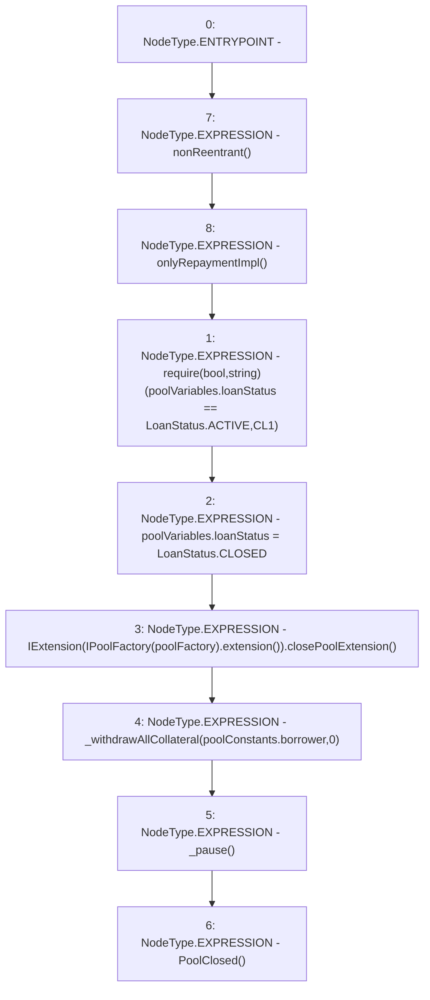

# Context: Pool.closeLoan

**Contract:** `Pool` (Inherits: ReentrancyGuard, IPool, ERC20PausableUpgradeable, PausableUpgradeable, ERC20Upgradeable, IERC20Upgradeable, ContextUpgradeable, Initializable)
**Signature:** `closeLoan()`
**Method Selector ID:** `0x232fa733`
**Visibility:** `external`
**Environment-Free:** `No (reads EVM state context)`
**Modifiers:**
- `nonReentrant`
  ```solidity
  modifier nonReentrant() {
          // On the first call to nonReentrant, _notEntered will be true
          require(_status != _ENTERED, "ReentrancyGuard: reentrant call");
  
          // Any calls to nonReentrant after this point will fail
          _status = _ENTERED;
  
          _;
  
          // By storing the original value once again, a refund is triggered (see
          // https://eips.ethereum.org/EIPS/eip-2200)
          _status = _NOT_ENTERED;
      }
  ```
- `onlyRepaymentImpl`
  ```solidity
  modifier onlyRepaymentImpl() {
          require(msg.sender == IPoolFactory(poolFactory).repaymentImpl(), 'OR1');
          _;
      }
  ```

### State Variables Interaction
- **Reads:** poolConstants, poolFactory, poolVariables
- **Writes:** poolVariables

### Assertion Checks & Business Requirements
- require/assert: `require(bool,string)(poolVariables.loanStatus == LoanStatus.ACTIVE,CL1)`

### Environment & Verification Flags
- **Uses Foundry Cheatcodes:** No
- **Has Echidna Properties:** No

### Internal Calls Tree
- None

### External Calls / Value Transfers
- `IPoolFactory.TMP_1734(address) = HIGH_LEVEL_CALL, dest:TMP_1733(IPoolFactory), function:extension, arguments:[]  `
- `IExtension.HIGH_LEVEL_CALL, dest:TMP_1735(IExtension), function:closePoolExtension, arguments:[]  `

### Control Flow Graph (CFG)


### Source Mapping
Declared in: `contracts/Pool/Pool.sol` on lines **591** to **601**

```solidity
    function closeLoan() external payable override nonReentrant onlyRepaymentImpl {
        require(poolVariables.loanStatus == LoanStatus.ACTIVE, 'CL1');

        poolVariables.loanStatus = LoanStatus.CLOSED;

        IExtension(IPoolFactory(poolFactory).extension()).closePoolExtension();
        _withdrawAllCollateral(poolConstants.borrower, 0);
        _pause();

        emit PoolClosed();
    }

```
