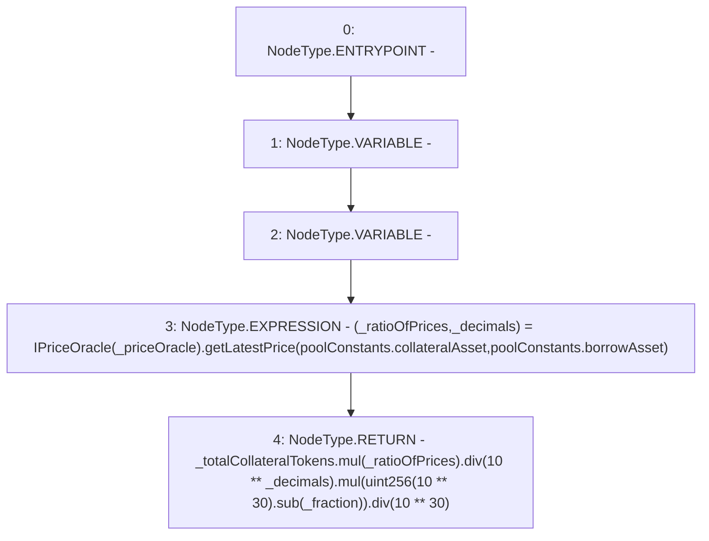

# Context: Pool.correspondingBorrowTokens

**Contract:** `Pool` (Inherits: ReentrancyGuard, IPool, ERC20PausableUpgradeable, PausableUpgradeable, ERC20Upgradeable, IERC20Upgradeable, ContextUpgradeable, Initializable)
**Signature:** `correspondingBorrowTokens(uint256,address,uint256) returns (uint256)`
**Method Selector ID:** `0x72954480`
**Visibility:** `public`
**Environment-Free:** `Yes`
**Modifiers:** None

### State Variables Interaction
- **Reads:** poolConstants
- **Writes:** None

### Environment & Verification Flags
- **Uses Foundry Cheatcodes:** No
- **Has Echidna Properties:** No

### Internal Calls Tree
- None

### External Calls / Value Transfers
- `SafeMathUpgradeable.TMP_1894(uint256) = LIBRARY_CALL, dest:SafeMathUpgradeable, function:SafeMathUpgradeable.div(uint256,uint256), arguments:['TMP_1892', 'TMP_1893'] `
- `SafeMathUpgradeable.TMP_1886(uint256) = LIBRARY_CALL, dest:SafeMathUpgradeable, function:SafeMathUpgradeable.mul(uint256,uint256), arguments:['_totalCollateralTokens', '_ratioOfPrices'] `
- `IPriceOracle.TUPLE_19(uint256,uint256) = HIGH_LEVEL_CALL, dest:TMP_1885(IPriceOracle), function:getLatestPrice, arguments:['REF_847', 'REF_848']  `
- `SafeMathUpgradeable.TMP_1891(uint256) = LIBRARY_CALL, dest:SafeMathUpgradeable, function:SafeMathUpgradeable.sub(uint256,uint256), arguments:['TMP_1890', '_fraction'] `
- `SafeMathUpgradeable.TMP_1892(uint256) = LIBRARY_CALL, dest:SafeMathUpgradeable, function:SafeMathUpgradeable.mul(uint256,uint256), arguments:['TMP_1888', 'TMP_1891'] `
- `SafeMathUpgradeable.TMP_1888(uint256) = LIBRARY_CALL, dest:SafeMathUpgradeable, function:SafeMathUpgradeable.div(uint256,uint256), arguments:['TMP_1886', 'TMP_1887'] `

### Control Flow Graph (CFG)


### Source Mapping
Declared in: `contracts/Pool/Pool.sol` on lines **899** to **909**

```solidity
    function correspondingBorrowTokens(
        uint256 _totalCollateralTokens,
        address _priceOracle,
        uint256 _fraction
    ) public view returns (uint256) {
        (uint256 _ratioOfPrices, uint256 _decimals) = IPriceOracle(_priceOracle).getLatestPrice(
            poolConstants.collateralAsset,
            poolConstants.borrowAsset
        );
        return _totalCollateralTokens.mul(_ratioOfPrices).div(10**_decimals).mul(uint256(10**30).sub(_fraction)).div(10**30);
    }

```
