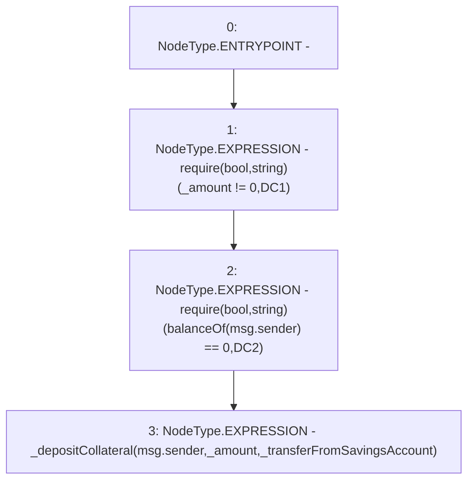

# Context: Pool.depositCollateral

**Contract:** `Pool` (Inherits: ReentrancyGuard, IPool, ERC20PausableUpgradeable, PausableUpgradeable, ERC20Upgradeable, IERC20Upgradeable, ContextUpgradeable, Initializable)
**Signature:** `depositCollateral(uint256,bool)`
**Method Selector ID:** `0xd2b93bfd`
**Visibility:** `external`
**Environment-Free:** `No (reads EVM state context)`
**Modifiers:** None

### State Variables Interaction
- **Reads:** None
- **Writes:** None

### Assertion Checks & Business Requirements
- require/assert: `require(bool,string)(_amount != 0,DC1)`
- require/assert: `require(bool,string)(balanceOf(msg.sender) == 0,DC2)`

### Environment & Verification Flags
- **Uses Foundry Cheatcodes:** No
- **Has Echidna Properties:** No

### Internal Calls Tree
- None

### External Calls / Value Transfers
- None

### Control Flow Graph (CFG)


### Source Mapping
Declared in: `contracts/Pool/Pool.sol` on lines **175** to **179**

```solidity
    function depositCollateral(uint256 _amount, bool _transferFromSavingsAccount) external payable override {
        require(_amount != 0, 'DC1');
        require(balanceOf(msg.sender) == 0, 'DC2');
        _depositCollateral(msg.sender, _amount, _transferFromSavingsAccount);
    }

```
