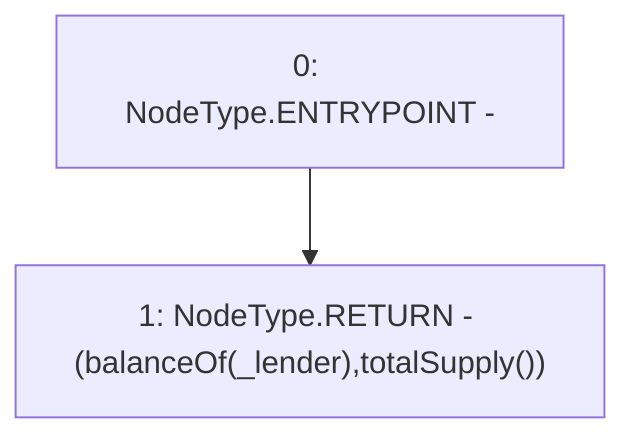

# Context: Pool.getBalanceDetails

**Contract:** `Pool` (Inherits: ReentrancyGuard, IPool, ERC20PausableUpgradeable, PausableUpgradeable, ERC20Upgradeable, IERC20Upgradeable, ContextUpgradeable, Initializable)
**Signature:** `getBalanceDetails(address) returns (uint256, uint256)`
**Method Selector ID:** `0xb2c09233`
**Visibility:** `external`
**Environment-Free:** `Yes`
**Modifiers:** None

### State Variables Interaction
- **Reads:** None
- **Writes:** None

### Environment & Verification Flags
- **Uses Foundry Cheatcodes:** No
- **Has Echidna Properties:** No

### Internal Calls Tree
- None

### External Calls / Value Transfers
- None

### Control Flow Graph (CFG)


### Source Mapping
Declared in: `contracts/Pool/Pool.sol` on lines **997** to **999**

```solidity
    function getBalanceDetails(address _lender) external view override returns (uint256, uint256) {
        return (balanceOf(_lender), totalSupply());
    }

```
