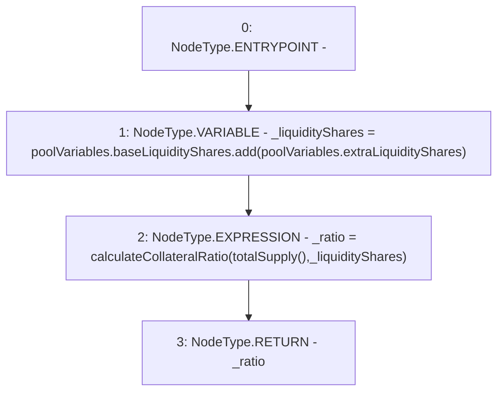

# Context: Pool.getCurrentCollateralRatio

**Contract:** `Pool` (Inherits: ReentrancyGuard, IPool, ERC20PausableUpgradeable, PausableUpgradeable, ERC20Upgradeable, IERC20Upgradeable, ContextUpgradeable, Initializable)
**Signature:** `getCurrentCollateralRatio() returns (uint256)`
**Method Selector ID:** `0xe70d72d7`
**Visibility:** `public`
**Environment-Free:** `No (reads EVM state context)`
**Modifiers:** None

### State Variables Interaction
- **Reads:** poolVariables
- **Writes:** None

### Environment & Verification Flags
- **Uses Foundry Cheatcodes:** No
- **Has Echidna Properties:** No

### Internal Calls Tree
- None

### External Calls / Value Transfers
- `SafeMathUpgradeable.TMP_1815(uint256) = LIBRARY_CALL, dest:SafeMathUpgradeable, function:SafeMathUpgradeable.add(uint256,uint256), arguments:['REF_791', 'REF_793'] `

### Control Flow Graph (CFG)


### Source Mapping
Declared in: `contracts/Pool/Pool.sol` on lines **709** to **713**

```solidity
    function getCurrentCollateralRatio() public returns (uint256 _ratio) {
        uint256 _liquidityShares = poolVariables.baseLiquidityShares.add(poolVariables.extraLiquidityShares);

        _ratio = calculateCollateralRatio(totalSupply(), _liquidityShares);
    }

```
