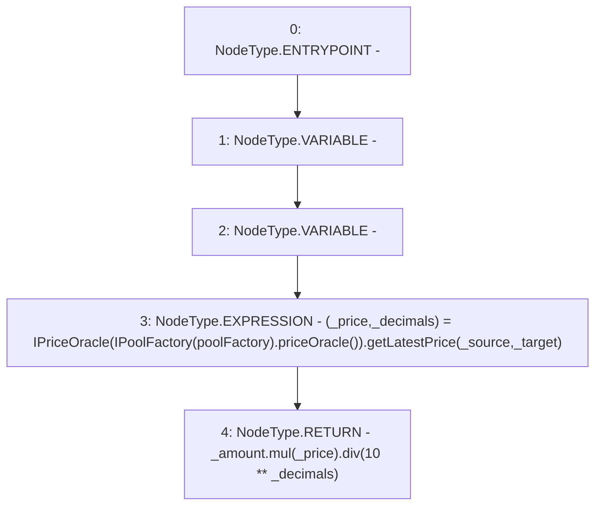

# Context: Pool.getEquivalentTokens

**Contract:** `Pool` (Inherits: ReentrancyGuard, IPool, ERC20PausableUpgradeable, PausableUpgradeable, ERC20Upgradeable, IERC20Upgradeable, ContextUpgradeable, Initializable)
**Signature:** `getEquivalentTokens(address,address,uint256) returns (uint256)`
**Method Selector ID:** `0x5afaa80f`
**Visibility:** `public`
**Environment-Free:** `Yes`
**Modifiers:** None

### State Variables Interaction
- **Reads:** poolFactory
- **Writes:** None

### Environment & Verification Flags
- **Uses Foundry Cheatcodes:** No
- **Has Echidna Properties:** No

### Internal Calls Tree
- None

### External Calls / Value Transfers
- `IPriceOracle.TUPLE_20(uint256,uint256) = HIGH_LEVEL_CALL, dest:TMP_1929(IPriceOracle), function:getLatestPrice, arguments:['_source', '_target']  `
- `SafeMathUpgradeable.TMP_1932(uint256) = LIBRARY_CALL, dest:SafeMathUpgradeable, function:SafeMathUpgradeable.div(uint256,uint256), arguments:['TMP_1930', 'TMP_1931'] `
- `SafeMathUpgradeable.TMP_1930(uint256) = LIBRARY_CALL, dest:SafeMathUpgradeable, function:SafeMathUpgradeable.mul(uint256,uint256), arguments:['_amount', '_price'] `
- `IPoolFactory.TMP_1928(address) = HIGH_LEVEL_CALL, dest:TMP_1927(IPoolFactory), function:priceOracle, arguments:[]  `

### Control Flow Graph (CFG)


### Source Mapping
Declared in: `contracts/Pool/Pool.sol` on lines **1021** to **1028**

```solidity
    function getEquivalentTokens(
        address _source,
        address _target,
        uint256 _amount
    ) public view returns (uint256) {
        (uint256 _price, uint256 _decimals) = IPriceOracle(IPoolFactory(poolFactory).priceOracle()).getLatestPrice(_source, _target);
        return _amount.mul(_price).div(10**_decimals);
    }

```
